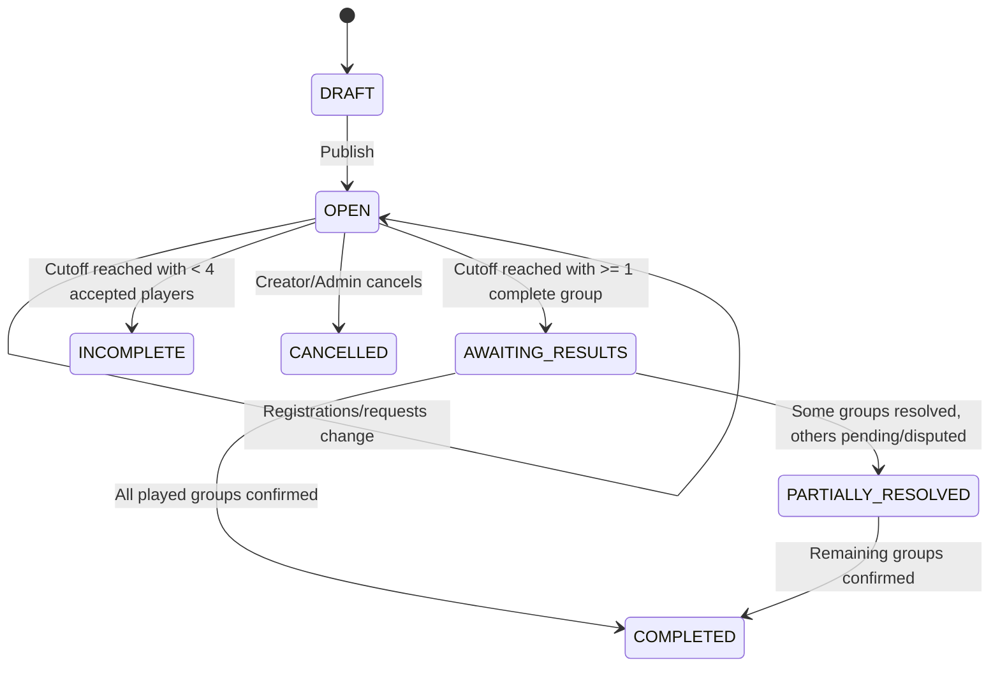
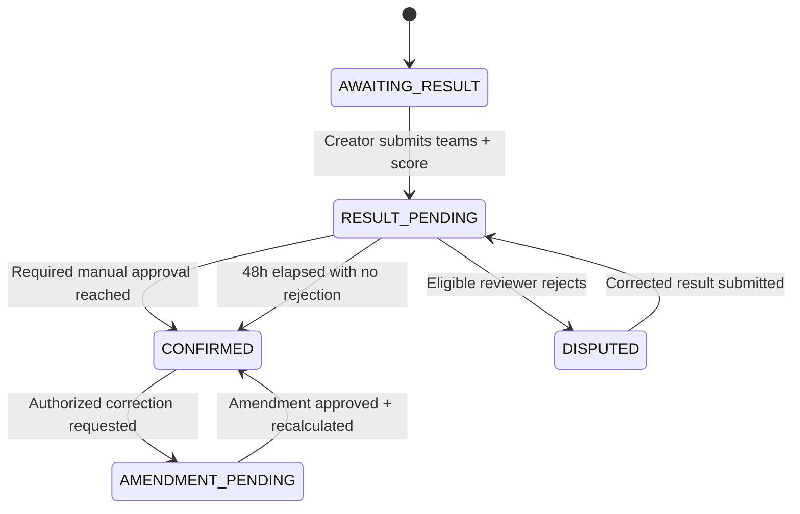
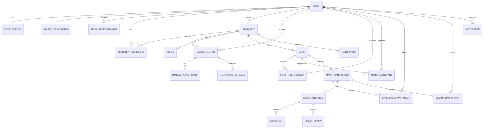

# Padel Friends — Product Requirements Document (PRD)

**Version:** V1  
**Status:** Working V1 PRD — requirements definition  
**Product type:** Community-based Padel Progressive Web App (PWA)  
**Primary audience:** Product, Design, Frontend, Backend, QA, DevOps  
**Last updated:** 2026-09-25

---

## 1. Executive Summary

Padel Friends is a community-based padel web application for people who want to organize matches, play with friends or other community players, maintain a trusted skill level, compete in rankings/leagues, and analyze detailed playing statistics.

A user has one app-wide player profile and can belong to multiple communities.

Communities can be:

- **Public** — discoverable by authenticated users. Non-members may see available public match events and may request to play without joining the community.
- **Private** — accessible only to members/invited users.

The app solves six main problems:

1. **Community organization** — any authenticated user can create communities, join communities, and discover available matches in public communities.
2. **Match organization** — users can create match events, invite players, accept registrations, handle Reserve players, and organize multiple groups of four.
3. **Recording trustworthy results** — the match creator records actual teams/results and eligible players approve or reject them; unresolved results auto-approve after 48 hours if nobody rejects them.
4. **Maintaining a fair dynamic skill level** — confirmed competitive results update each player's app-wide level based on team strength, result, player reliability, and expected outcome.
5. **Running leagues/rankings** — communities can create rankings with a fixed end date or an open-ended/manual end and retain historical standings.
6. **Providing rich statistics and history** — players can inspect match history, wins/losses/draws, sets, games, partners, opponents, head-to-head records, streaks, rating progression, community performance, and League performance.

This is **not** intended to reproduce Playtomic's commercial court-booking marketplace. There is no requirement for court inventory, club payments, split payments, subscriptions, or integration with Playtomic accounts.

The product should feel like a lightweight community padel league + match organizer + statistics platform.

---

# 2. Product Vision

> Give padel players one trusted place to organize communities and matches, record results, compare performance, and compete in rankings without the overhead of a commercial court-booking marketplace.

The key product qualities are:

- **Simple enough to use after every match.**
- **Fair enough that players trust the ranking.**
- **Transparent enough that every rating change can be explained.**
- **Social enough to support multiple friend groups and public communities.**
- **Private when a community chooses to be private.**
- **Discoverable when a community chooses to be public.**
- **Mobile-first and installable as a PWA.**
- **Cloud-synchronized so all authorized users immediately see the same state.**

---

# 3. Goals

## 3.1 Primary goals

### G-01 — Multiple communities

Any authenticated user can create a community and choose whether it is Public or Private. A user may belong to multiple communities.

### G-02 — Match organization

Users can create, discover, join/request-to-join, leave, invite players to, and manage padel Match Events.

### G-03 — Trusted results

The system provides a creator-led result-submission workflow, player validation, rejection/dispute handling, and 48-hour auto-confirmation when no rejection occurs.

### G-04 — Dynamic player skill

Each player has one app-wide persistent skill level on a 0–7 scale that changes after confirmed competitive Game Groups.

### G-05 — Reliability

Each player has a visible reliability percentage beginning at 10% and increasing with confirmed competitive match experience until reaching 100% after 15 confirmed competitive Game Groups.

### G-06 — Leagues / rankings

Community members can create rankings and compare players during a defined period. A ranking may have a fixed end date or remain open until its creator/Admin ends it.

### G-07 — Deep statistics

The app exposes useful statistics at player, match, Game Group, pair, opponent, community, League, and all-time levels.

### G-08 — Shared cloud state

All authorized users see the same matches, results, ratings, standings, and statistics across devices.

### G-09 — PWA/mobile experience

The product is usable from a mobile browser and can be installed on supported devices as a PWA.

---

# 4. Non-Goals

The following are explicitly out of scope for V1 unless later added:

- Court availability search.
- Court booking with clubs.
- Online payment processing.
- Split payments.
- Commercial marketplace transactions.
- Finding arbitrary nearby players by geolocation.
- Coach marketplace.
- Tournament bracket management.
- Advertising.
- Premium subscriptions.
- Integration with Playtomic accounts or Playtomic APIs.
- Wearable integration.
- Live point-by-point scoring.
- Video analysis.
- Official federation rankings.
- Importing historical pre-launch match data.

Public community discovery and public-community Match Event discovery **are in scope**.

The internal domain model should not prevent future expansion, but those future capabilities must not complicate V1.

---

# 5. Reference Product Analysis

Playtomic is a useful benchmark for several interaction patterns, but Padel Friends intentionally focuses on communities, match organization, rankings, and statistics rather than court-booking commerce.

Useful concepts to retain or adapt:

- Competitive vs. friendly/casual matches.
- Open matches.
- Player skill level.
- A visible 0–7 padel level scale.
- Rating reliability/confidence.
- Skill adjustment based on opponents and partner.
- Player profile and rating progression.
- Match history.
- Match statistics.
- Opponent validation of submitted results.
- Draws affecting rating according to relative team strength.

Concepts to omit:

- Club marketplace.
- Court-booking inventory.
- Payment collection.
- Club wallets.
- Commercial leagues.
- Public social feed.
- Geographic discovery of arbitrary unknown players.

Padel Friends additionally introduces:

- user-created Public or Private communities;
- non-member guest requests to public-community matches;
- creator-managed multi-group Match Events;
- Reserve handling in groups of four;
- League creation by users.

---

# 6. Confirmed Product Rules and Defaults

The following decisions are confirmed requirements for V1 unless explicitly marked configurable.

| Topic                                 | Confirmed rule                                                                                                                       |
| ------------------------------------- | ------------------------------------------------------------------------------------------------------------------------------------ |
| Communities                           | Multiple communities per user                                                                                                        |
| Community creation                    | Any authenticated user can create a community                                                                                        |
| Community visibility                  | Public or Private                                                                                                                    |
| Public community                      | Discoverable; authenticated non-members may view available matches and request to play                                               |
| Private community                     | Only members/invited users may access community matches                                                                              |
| Guest player                          | A non-member of a Public community may request a place; Match Creator must approve                                                   |
| Guest FIFO                            | Registration order starts when the creator approves the guest request, not when the request was submitted                            |
| Player profile                        | One app-wide player profile, reused across all communities                                                                           |
| Skill scale                           | 0.0–7.0, matching the familiar Playtomic padel scale                                                                                 |
| Initial skill                         | User chooses level once during app onboarding                                                                                        |
| Initial reliability                   | 10%                                                                                                                                  |
| Reliability maturation                | +6 percentage points per confirmed competitive Game Group, capped at 100%; reaches 100% after 15                                     |
| Manual level changes                  | Players and Community Admins cannot directly modify a player's level                                                                 |
| Level review                          | Player requests a review; only Platform/App Admin may approve and perform a manual correction                                        |
| Level review effect                   | Approved manual correction is forward-only; past matches and historical ratings are not replayed because of the correction           |
| Match event size                      | Any registration count; playable Game Groups are always 4 players                                                                    |
| Reserve rule                          | Registrations that do not complete the next group of 4 remain Reserve                                                                |
| Reserve promotion                     | FIFO by accepted registration time                                                                                                   |
| Creator removal                       | Creator may remove a registered player before cutoff; statuses are recalculated and next Reserve player is promoted as applicable    |
| Registration cutoff                   | Defaults to 1 hour before match start; creator may adjust it                                                                         |
| Team assignment                       | Creator chooses Predefined Teams or Post-Match Teams                                                                                 |
| Multiple groups/courts                | One event-level venue; each Game Group may optionally have its own court name/number                                                 |
| Match types                           | Competitive or Friendly                                                                                                              |
| League inclusion                      | Eligible confirmed Competitive Game Groups inside the active League period count automatically; there is no per-match opt-out        |
| Venue                                 | Creator provides place, Google Maps link, and venue/court photo                                                                      |
| Cost                                  | Optional informational per-player amount/currency; no payment processing                                                             |
| Level restriction                     | Optional; default range derived from creator level using -0.5 / +1.5, clamped to 0–7; creator can edit/disable                       |
| Out-of-range member                   | May request creator approval instead of direct registration                                                                          |
| Result entry                          | Match Creator is primary result recorder                                                                                             |
| Result approval, creator played       | One player from opposing team                                                                                                        |
| Result approval, creator did not play | At least one player from each team                                                                                                   |
| Auto-approval                         | Pending result auto-confirms 48 hours after submission if no eligible reviewer has rejected it, even if manual approvals are partial |
| Rejection                             | Prevents auto-confirmation and moves result to Disputed                                                                              |
| Rated Draw                            | Requires exactly one completed set won by each team and no completed third set                                                       |
| Incomplete/abandoned result           | If play stops before each team has won one completed set, result is Incomplete/Abandoned and has no rating/ranking effect            |
| Unfinished third set                  | May be recorded as incomplete; its current score does not decide winner; match outcome is Draw only if completed sets are tied 1–1   |
| Third set                             | Normal padel set only; no deciding match-tiebreak format in V1                                                                       |
| Score margin                          | Stored for statistics but does not directly multiply rating change                                                                   |
| Historical pre-launch import          | Out of scope                                                                                                                         |
| Sporting history                      | Visible to community members; public-community visibility follows community privacy rules                                            |
| League/ranking duration               | Fixed End Date or Open Ended / Manual                                                                                                |
| Concurrent rankings                   | Maximum one active ranking per community in V1; schema prepared for more                                                             |
| Mid-ranking join                      | New community members may join an already-active ranking when they play their first eligible ranked match                            |
| Friendly match                        | Never changes skill or League standings                                                                                              |
| Major match changes                   | Competitive/Friendly or materially changed date/time after registrations require participant reconfirmation                          |
| Minor match changes                   | Venue/court, price, notes and similar details may change with notifications                                                          |
| Notifications                         | In-app required; push supported by PWA                                                                                               |
| Offline authoritative writes          | Not required                                                                                                                         |

---

# 7. Important Product Concepts

## 7.1 App-Wide Player Skill

A player has one long-term estimate of padel ability for the entire application.

Properties:

- belongs to the user, not to a specific community or league;
- uses a visible 0.0–7.0 scale;
- initializes from the user's onboarding level;
- changes only from confirmed ratable Competitive Game Groups;
- continues evolving for the lifetime of the player's account;
- matches played in any eligible community may affect it;
- Friendly and Incomplete/Abandoned Game Groups do not affect it;
- includes a visible reliability percentage;
- has immutable rating history.

Example:

- Thiago: level 3.82, reliability 76%.

## 7.2 Reliability

Reliability expresses how established the app considers the player's current global level.

V1 rule:

```text
reliability = min(100, 10 + 6 * confirmed_competitive_game_groups)
```

Reliability is global and is **not** reset when a league starts or ends.

## 7.3 Community

A Community is an organizational space containing:

- members;
- admins;
- Match Events;
- leagues;
- community statistics;
- saved venues/settings.

A player can belong to several communities without having separate player levels.

## 7.4 League / League Standings

A League is a time-bounded or manually-ended competition inside one community.

A League does **not** have its own skill rating.

League standings are calculated only from eligible confirmed match results played during the league period.

The player's app-wide 0–7 level:

- continues updating normally while the league is running;
- may be displayed next to the player for informational purposes;
- is never used to calculate or order league standings.

The league uses competition statistics such as:

- wins;
- losses;
- draws;
- sets won;
- sets lost;
- set differential.

When the league ends, its final standings freeze, while the player's app-wide skill continues evolving.

## 7.5 Match Event vs. Game Group

A **Match Event** is the organizational event created in a community. It has:

- date/time;
- venue;
- Google Maps link;
- venue/court photo;
- optional price per player;
- registrations;
- Reserve players;
- optional predefined teams;
- one or more playable Game Groups.

A **Game Group** is one actual padel match:

- exactly 4 players;
- Team A with 2 players;
- Team B with 2 players;
- its own score;
- its own approval state;
- its own global rating/statistical effects.

## 7.6 Registration and Reserve Status

For accepted registrations:

```text
registered_count = N
playable_player_count = floor(N / 4) * 4
reserve_count = N mod 4
```

The accepted-registration order is authoritative for Playing vs Reserve.

A public-community guest request does not receive an accepted-registration position until the creator approves it.

## 7.7 Team Assignment Modes

### PREDEFINED_TEAMS

Creator defines 4-player groups and teams before play.

### POST_MATCH_TEAMS

Confirmed players are listed without final team assignment. After play, creator records the actual groups/teams.

## 7.8 Confirmed Result

A Game Group becomes authoritative after:

- the required approval is received; or
- 48 hours elapse after submission without a rejection.

Only then do:

- global Competitive rating/reliability update, when the result is ratable;
- league standings update, when the Game Group is eligible for an active league;
- official statistics update.

---

# 8. Roles and Permissions

## 8.1 Authenticated User

Any authenticated user can:

- maintain their app-wide player profile;
- create a community;
- discover Public communities;
- join Public communities where self-join is enabled;
- request to play in an available Public-community match without becoming a member;
- request a manual review of their player level.

## 8.2 Community Member

A Community Member can:

- view the community according to its privacy;
- view member sporting history;
- create Match Events;
- invite players;
- register for eligible community matches;
- create a League;
- participate in community rankings;
- view community statistics/history.

## 8.3 Match Creator

The Match Creator can:

- edit event details before cutoff according to lifecycle rules;
- approve/reject guest join requests;
- approve out-of-level-range registration requests;
- remove a registered player before cutoff;
- arrange predefined groups/teams;
- assign actual post-match groups/teams;
- enter results;
- correct an unconfirmed result proposal.

Removing a player must be audited and the removed player must be notified.

## 8.4 Community Admin

A Community Admin can:

- edit community settings;
- manage memberships;
- invite/remove community members;
- promote/demote Community Admins;
- manage community rankings;
- manage saved venues;
- resolve community match disputes;
- cancel invalid Match Events;
- inspect community audit history.

A Community Admin **cannot directly edit a player's app-wide skill level**.

## 8.5 Platform / App Admin

A Platform Admin has the limited system-level capabilities needed to:

- review player-submitted level review requests;
- approve/reject a requested manual level adjustment;
- perform an approved manual level correction;
- inspect the associated evidence/audit history;
- run administrative repair/recalculation operations where necessary.

Manual level changes must never be a normal Community Admin capability.

---

# 9. Community Model

## 9.1 Multiple Communities

A user may:

- create multiple communities;
- belong to multiple communities;
- leave a community without affecting membership in others;
- use the same app-wide profile/level everywhere.

Every community-scoped entity must include `community_id`.

## 9.2 Creating a Community

Any authenticated user can create a community.

Required fields:

- name;
- visibility: `PUBLIC` or `PRIVATE`.

Optional fields:

- description;
- image/logo;
- city/area label;
- default settings.

The creator becomes the initial Community Admin.

## 9.3 Public Community

A Public community:

- is discoverable by authenticated users;
- exposes its basic profile;
- exposes available Public Match Events;
- may allow authenticated users to join the community directly;
- allows non-members to request a place in eligible Public Match Events.

A non-member guest who is approved for a match:

- does **not** automatically become a community member;
- receives a normal accepted registration at approval time;
- can play and have the result affect their app-wide level;
- appears in that Match Event's history/statistics;
- is not eligible for the community's League standings unless they become a member.

If a Match Event is explicitly bound to an active community ranking, only community members may participate in that ranked Game Group in V1. A non-member may be invited to join the community first or the event can be non-ranking.

## 9.4 Private Community

A Private community:

- is not generally discoverable;
- is accessible through invitation or an authorized join flow;
- does not expose its Match Events to non-members;
- does not allow guest join requests from non-members.

## 9.5 Joining a Community

### Public

Default V1 behavior:

- authenticated user can join directly;
- community may optionally require admin approval.

### Private

User must:

- receive invitation or valid private join link;
- authenticate;
- accept;
- satisfy any configured admin approval.

## 9.6 Leaving / Removing a Member

Leaving/removal does not delete historical data.

The membership becomes inactive.

Historical records retain the player's identity reference and sporting facts.

Inactive members cannot create or register in new Private-community events unless reactivated.

---

# 10. Authentication Requirements

## FR-AUTH-001

The application shall require authentication for all community content.

## FR-AUTH-002

The implementation shall support at least one low-friction authentication mechanism such as:

- email magic link;
- email/password;
- OAuth provider.

The product requirement does not mandate a specific identity provider.

## FR-AUTH-003

Authentication identity and player profile shall be separate domain concepts.

## FR-AUTH-004

Authorization must be enforced server-side.

The client must never be trusted to decide whether a user may:

- join a match;
- approve a result;
- alter a League;
- change a rating;
- edit another user;
- access unauthorized Private-community data.

---

# 11. Player Profile

The player profile is **app-wide**, not community-specific.

## 11.1 Required onboarding fields

- Display name.
- Preferred court side:
  - Left.
  - Right.
  - Either.
- Initial padel level on a 0.0–7.0 scale.

## 11.2 Profile/system fields

- Avatar, initials fallback allowed.
- Current displayed level.
- Reliability percentage.
- Confirmed Competitive Game Group count.
- Join date.
- Highest achieved level.
- Rating history.

## 11.3 Optional fields

- Dominant hand.
- Short bio.
- Preferred playing days/times.
- Phone/contact data, private by default.

## 11.4 Visibility

Sporting information may be visible:

- to members of communities where the user participates;
- in Public-community Match Event context;
- according to future profile privacy controls.

Authentication email and security/account data must not automatically be exposed.

## 11.5 Community Context

When displaying a profile from inside a community, the UI can show:

- app-wide current level/reliability;
- community-specific match history;
- community-specific statistics;
- current community League position;
- all-time community performance.

---

# 12. Initial Skill, Reliability, and Level Review

## 12.1 Initial Skill

During first app registration/onboarding, the user chooses their starting padel level on the **0.0–7.0** scale.

This intentionally matches the familiar Playtomic padel range so existing players can enter a level they already understand.

Recommended input step:

```text
0.1
```

The selected starting level becomes the initial app-wide displayed level.

## 12.2 Initial Reliability

At registration:

```text
reliability = 10%
confirmed_competitive_game_groups = 0
```

The level is valid immediately; it is simply low-confidence.

## 12.3 Reliability Progression

```text
reliability = min(100, 10 + 6 × confirmed_competitive_game_groups)
```

Examples:

- 0 matches => 10%.
- 5 matches => 40%.
- 10 matches => 70%.
- 15 matches => 100%.
- 15+ matches => 100%.

Only confirmed Competitive Game Groups with a ratable outcome (`WIN`, `LOSS`, `DRAW`) increase reliability.

Friendly, Incomplete/Abandoned, Disputed, Canceled, Reserve-not-played, or Unconfirmed results do not.

## 12.4 Level Changes from Matches

Level can change after the **first confirmed ratable Competitive Game Group**.

Lower reliability permits larger corrections.

Higher reliability produces more stable changes.

## 12.5 No Direct User/Admin Editing

After onboarding:

- player cannot directly edit their level;
- Community Admin cannot directly edit any player's level;
- Match Creator cannot edit levels.

## 12.6 Player Level Review Request

If a player believes their level is materially incorrect, they can submit a **Level Review Request**.

Fields:

- current level;
- requested/expected level or range;
- reason;
- optional notes/evidence;
- created timestamp.

Statuses:

- `PENDING`
- `UNDER_REVIEW`
- `APPROVED`
- `REJECTED`
- `CANCELLED`

Only a Platform/App Admin may resolve the request.

## 12.7 Approved Review Is Forward-Only

If approved:

- admin sets the corrected current app-wide level;
- an immutable `ADMIN_REVIEW_ADJUSTMENT` rating event is created;
- previous value is retained in audit/history;
- request ID and reason are linked;
- future Competitive Game Groups start from the corrected rating state.

The system **does not replay or recalculate historical matches** because of an administrative level correction.

This avoids rewriting historical standings across communities based on information that was not known at the time.

Reliability is preserved by default unless the Platform Admin explicitly chooses a documented reliability reset/reduction as part of the review.

---

# 13. Match Types

## 13.1 Competitive Match

A confirmed ratable Competitive Game Group:

- updates app-wide skill;
- updates app-wide reliability;
- contributes to an active league's standings when it is an eligible league-period match;
- affects Competitive statistics;
- appears in rating history.

League standings never use the player's app-wide skill level as a ranking input.

## 13.2 Friendly Match

A Friendly Game Group:

- never changes app-wide skill;
- never changes reliability;
- never counts toward league standings;
- still stores the full score;
- still appears in match history;
- still contributes to Friendly/All-match statistics.

The application shall distinguish:

- `All matches`
- `Competitive`
- `Friendly`

## 13.3 Match Type Locking

Once another player has accepted/joined the Match Event, the creator must not silently switch between Competitive and Friendly.

A Competitive ↔ Friendly change is a Major change and requires participant reconfirmation.

---

# 14. Match Visibility and Eligibility

## 14.1 Community Match Visibility

A Match Event belongs to exactly one community.

Within that community it can be:

- `COMMUNITY_OPEN`
- `INVITE_ONLY`

## 14.2 Public Community + Community Open Match

Visible to:

- community members;
- authenticated non-members browsing the Public community.

Registration behavior:

- eligible community members can register directly;
- out-of-range community members may request creator approval;
- non-members must always request creator approval.

Approval of a non-member guest does not add them to the community.

## 14.3 Private Community + Community Open Match

Visible only to community members.

Eligible members can register directly.

Out-of-range members may request creator approval if level restrictions are enabled.

## 14.4 Invite Only

Visible to:

- creator;
- invited users;
- accepted participants;
- relevant Community Admins.

Invitation does not bypass level/registration rules unless creator explicitly approves an exception.

---

# 15. Match Creation

Any Community Member can create a Match Event inside a community.

A Match Event may contain any number of accepted registrations; playable Game Groups are formed in multiples of four.

## 15.1 Required Inputs

- Community.
- Date.
- Start time.
- Match type: Competitive or Friendly.
- Visibility: Community Open or Invite Only.
- Venue/place name.
- Google Maps URL.
- Venue/court photo.
- Team assignment mode:
  - `PREDEFINED_TEAMS`
  - `POST_MATCH_TEAMS`.

## 15.2 Optional Inputs

- Saved Venue.
- Event-level court/area notes.
- Expected duration.
- Notes.
- Level restriction enabled/disabled.
- Custom minimum/maximum level.
- Invite specific players.
- "Court already booked" indicator.
- Price per player.
- Currency.
- Payment note.
- Maximum registrations.
- Custom registration cutoff.

There is no per-match "count toward league" toggle in V1. League inclusion is determined automatically from league period, community, participant eligibility, match type, and confirmed result.

## 15.3 Registration Cutoff

Default:

```text
registration_cutoff_at = scheduled_start_at - 1 hour
```

The creator may move the cutoff earlier or later, but it must remain before the scheduled start time.

At cutoff:

- new registrations stop;
- pending guest/out-of-range join requests expire;
- complete quartets remain Playing;
- residual Reserve players become `RESERVE_NOT_PLAYING`;
- affected users are notified.

## 15.4 Venue and Court Information

Required event-level presentation:

- place/venue name;
- clickable Google Maps link;
- venue/court photo.

For Match Events with more than one Game Group, each Game Group may optionally define:

- court name;
- court number;
- short court note.

No court-booking/inventory logic is required.

## 15.5 Per-Player Cost

Creator may specify an informational amount.

No payment collection occurs in V1.

If cost changes after registrations exist:

- notify all accepted/Reserve players;
- audit previous/new amount.

## 15.6 Match Creator

Creator registers automatically unless future organizer-only mode is explicitly enabled.

## 15.7 Default Level Range

When level restriction is enabled:

```text
default_min = max(0.0, creator_level - 0.5)
default_max = min(7.0, creator_level + 1.5)
```

Creator can edit or disable the range.

## 15.8 Range Eligibility

### Community Member

- in range => direct registration;
- out of range => may request Match Creator approval.

### Non-Member of a Public Community

- must request Match Creator approval;
- accepted FIFO time is approval time.

## 15.9 League Inclusion

If the community has an Active League, every eligible confirmed Competitive Game Group whose `played_at` falls within the League period contributes automatically to League standings.

League inclusion is based on match facts, not player skill level.

A League-eligible result:

- updates the player's app-wide level/reliability in the normal Competitive rating engine;
- separately updates League standings counters;
- does not create a League-specific skill rating.

Friendly and Incomplete/Abandoned Game Groups never count toward League standings.

V1 League standings contain community members. Non-member guests can participate in normal Public-community Competitive matches and affect app-wide skill, but are not included in League standings.

## 15.10 Registration Capacity and Multiples of Four

```text
playable_groups = floor(accepted_registration_count / 4)
confirmed_players = playable_groups * 4
reserve_players = accepted_registration_count % 4
```

## 15.11 Reserve Promotion

Reserve handling is FIFO by **accepted registration time**.

When the fourth player of the next quartet is accepted, all four become Playing atomically.

## 15.12 Team Assignment

### PREDEFINED_TEAMS

Creator organizes confirmed players into Game Groups/teams before play.

### POST_MATCH_TEAMS

Only confirmed player list is authoritative before play. Creator records actual Game Groups/teams after the event.

## 15.13 Changes After Registration Has Started

### Minor changes

Examples:

- venue;
- court name/number;
- price;
- payment note;
- event notes.

Behavior:

- notify participants;
- no reconfirmation required.

### Major changes

Examples:

- Competitive ↔ Friendly;
- materially changing date/time.

Behavior:

- existing accepted registrations move to `RECONFIRMATION_REQUIRED`;
- users must explicitly reconfirm.

Changing date/time can also change whether a Competitive result falls inside the Active League period, so the UI must explicitly warn participants when a Major date/time change changes League eligibility.

Recommended material time threshold:

```text
30 minutes
```

## 15.14 Validation

Reject:

- duplicate user registration;
- unauthorized user;
- invalid 4-player group;
- team not containing exactly 2 players;
- duplicated player across simultaneous Game Groups;
- Reserve player in played group;
- player without initialized app-wide skill in Competitive group;
- invalid Maps URL;
- negative price;
- unsupported currency;
- invalid level range;
- cutoff at/after match start.

---

# 16. Open Match Discovery

The main Match screen shall provide at least:

- `Available`
- `My Matches`
- `Past`

## 16.1 Available

Shows future Group Open match events accepting registrations.

Card/list information should include:

- date/time;
- venue;
- venue photo thumbnail;
- action to open Google Maps;
- match type;
- creator;
- confirmed player count;
- playable game-group count;
- Reserve count;
- "X more players needed for another court/group";
- optional maximum registrations;
- price per player, if provided;
- approximate player level;
- optional level requirement;
- League indicator;
- team mode: predefined or assigned after play;
- notes indicator.

Example:

```text
Saturday 10:30 — Padel Indoor Madrid
8 confirmed · 2 groups
2 reserve · 2 more needed to form Group 3
€8.50/player
Teams assigned after play
```

## 16.2 Filters

Recommended filters:

- date;
- competitive/friendly;
- venue;
- accepting registrations;
- currently in Reserve;
- suitable for my level;
- League;
- created by.

## 16.3 My Matches

Contains events where the user is:

- creator;
- confirmed participant;
- Reserve;
- invited;
- awaiting a result-review action.

The user's participation badge must be immediately understandable:

- `PLAYING`
- `RESERVE`
- `INVITED`
- `RESULT ACTION REQUIRED`

## 16.4 Past

Contains:

- events with confirmed game-group results;
- friendly events with confirmed results;
- canceled events if user chooses to show them;
- disputed game groups requiring attention;
- events where the user was Reserve and did not play, clearly distinguished from played match history.

---

# 17. Joining / Requesting to Join a Match

## FR-MATCH-101 — Direct registration

An eligible community member can directly register for a Community Open Match when:

- community authorization permits it; and
- they satisfy any enabled level range.

## FR-MATCH-102 — Public-community guest request

An authenticated user who is not a member of a Public community may request to play in an available Community Open Match.

The request does not yet create an accepted registration.

## FR-MATCH-103 — Creator approval

Match Creator can Approve or Reject a guest request.

On approval:

- accepted registration is created;
- FIFO position timestamp = approval timestamp;
- Playing/Reserve state is recalculated;
- requester is notified;
- requester remains a non-member guest.

## FR-MATCH-104 — Out-of-range member request

A community member outside the configured level range may request creator approval.

If approved, they enter the accepted-registration FIFO at approval time.

## FR-MATCH-105 — Atomicity

Accepted registration must be atomic and idempotent.

## FR-MATCH-106 — Unlimited group formation

Registration does not stop at 4 unless creator configured an explicit maximum.

## FR-MATCH-107 — Reserve calculation

If accepted registration count is not a multiple of four, the newest incomplete quartet remains Reserve.

## FR-MATCH-108 — Quartet completion

When a new accepted registration completes the next quartet, all four Reserve players in that quartet are promoted atomically.

## FR-MATCH-109 — Predefined teams

Only Playing/Confirmed players may be placed into a Game Group.

## FR-MATCH-110 — Duplicate protection

A user cannot hold more than one accepted registration or pending request for the same Match Event.

## FR-MATCH-111 — Maximum capacity

If creator configured a maximum registration count, no additional accepted registration may exceed it.

---

# 18. Invitations

A creator can invite community members.

Invitation states:

- `PENDING`
- `ACCEPTED`
- `DECLINED`
- `CANCELLED`
- `EXPIRED`

## 18.1 Invite Behavior

Invited user receives:

- in-app notification;
- optional push notification;
- deep link to match.

The user may:

- accept;
- decline;
- inspect match first.

## 18.2 Invitation and Registration Behavior

An invitation does not permanently reserve one of only four slots because a Match Event may contain multiple groups of four.

Recommended V1 behavior:

- invitation remains `PENDING` until accepted/declined/expired;
- when accepted, the user receives a normal registration position;
- Playing vs Reserve is then calculated using the same FIFO registration rules as any other participant;
- accepting an invitation does not bypass Reserve rules;
- if the creator configured `max_registrations`, acceptance fails only when that explicit capacity has been reached.

Example:

- 6 players are already registered;
- an invited player accepts and becomes registration #7 => Reserve;
- another invited/open player becomes registration #8 => registrations #5–#8 are promoted to Playing.

Invitations themselves do not hold a registration position before acceptance unless a future explicit "reserved invitation" feature is introduced.

---

# 19. Leaving, Creator Removal, and Canceling

## 19.1 Player Self-Removal Before Cutoff

A registered player may leave before `registration_cutoff_at`.

After removal:

1. mark registration withdrawn;
2. recalculate accepted-registration FIFO;
3. recompute Playing vs Reserve;
4. promote/demote affected users deterministically;
5. notify affected users.

## 19.2 Creator Removes a Player

Before registration cutoff, the Match Creator may remove a registered player when the player is unable to attend or cannot remove themselves.

Requirements:

- creator selects/enters a reason;
- removed player is notified;
- action is audited;
- registration becomes `REMOVED_BY_CREATOR`;
- accepted-registration order is recalculated;
- next Reserve player is promoted if a complete quartet can be maintained.

Creator removal must not silently alter completed/past Game Groups.

## 19.3 Creator Leaves as a Player

Creator can withdraw from the player list while retaining organizer ownership.

Ownership may also be transferred.

## 19.4 Cancel Event

Creator or authorized Community Admin may cancel before play.

All registered/invited/requesting users are notified.

## 19.5 Registration Cutoff

Default cutoff is one hour before scheduled start unless creator changed it.

At cutoff:

- direct registration closes;
- pending join requests expire;
- complete quartets remain Playing;
- residual 1–3 Reserve players become `RESERVE_NOT_PLAYING`;
- Reserve-not-playing users receive a high-priority notification;
- if fewer than four accepted registrations exist, no Game Group proceeds;
- Game Group/court planning can be finalized.

## 19.6 After Result Submission

Normal leave/remove operations cannot alter a Game Group with an active or confirmed result.

Correction uses the dispute/amendment process.

---

# 20. Match Lifecycle

The lifecycle has two levels:

1. Match Event lifecycle.
2. Per-Game-Group result lifecycle.

## 20.1 Match Event Lifecycle



Reserve players do not block completed quartets from playing.

## 20.2 Game Group Result Lifecycle



Every new or corrected Result Proposal gets its own:

```text
auto_confirm_at = submitted_at + 48 hours
```

## 20.3 Event Creation Timing

V1 does not support importing or creating arbitrary pre-launch historical Match Events.

Normal workflow:

- create Match Event before play;
- play it;
- record results afterward;
- result may be entered later for that already-existing event.

---

# 21. Result Entry

After the scheduled match event has finished, the **Match Creator** sees a prominent action:

**Record results**

The creator records results independently for each playable Game Group.

An Admin may perform the same action when resolving an abandoned or disputed event.

## 21.1 Post-Match Group and Team Assignment

If the event used `POST_MATCH_TEAMS`, the creator must first define how the confirmed players actually played.

For each Game Group:

1. select exactly 4 confirmed players;
2. assign exactly 2 to Team A;
3. assign exactly 2 to Team B;
4. ensure a player is not used in another Game Group in the same event unless a future multi-round format explicitly permits it.

If the event used `PREDEFINED_TEAMS`, the creator sees the planned groups/teams and must confirm or correct them before score entry.

This means the stored final team assignment always represents what actually happened, not merely what was planned.

## 21.2 Result Submission Steps

For each Game Group:

1. Confirm the 4 actual players.
2. Confirm Team A / Team B.
3. Confirm match type.
4. Enter set scores.
5. System validates scoring rules.
6. Preview match winner.
7. Preview whether rating will be affected.
8. Submit.

The Game Group result is not yet final.

Status becomes `RESULT_PENDING`.

## 21.3 Submitter Rules

The Match Creator is the normal submitter.

An Admin may submit when necessary.

A normal participant other than the creator may be allowed to submit only if:

- creator explicitly delegates result-entry permission; or
- community settings enable participant submission.

V1 default: creator-led result entry.

## 21.4 Approval Rules

### Creator played in that Game Group

If the creator/submitting user is one of the 4 players:

- at least one player from the opposing team must approve;
- the submitter's teammate cannot satisfy the required opposing-team approval.

### Creator did not play in that Game Group

For events with 8, 12, or more players, the creator may submit a result for a Game Group they did not personally play in.

In that case, confirmation requires:

- at least one Team A player approval; and
- at least one Team B player approval.

This prevents a non-playing organizer from unilaterally finalizing a competitive result.

### Admin override

An Admin may resolve a disputed/abandoned result through an explicit audited override flow.

## 21.5 Multiple Game Groups

An event with multiple Game Groups can be partially resolved.

Example:

- Group 1: Confirmed.
- Group 2: Result Pending.
- Group 3: Disputed.

Rating/statistics effects apply only to Group 1 until the others become Confirmed.

The parent Match Event becomes fully `COMPLETED` only after all played Game Groups are resolved.

---

# 22. Padel Score Validation

## 22.1 Default Format

V1 uses standard best-of-3 with a **normal third set**.

No deciding match-tiebreak format is supported in V1.

A completed normal set is valid when:

- 6-0 through 6-4;
- 7-5;
- 7-6.

## 22.2 Normal Win

First team to win 2 completed sets wins.

Example:

```text
6-4, 3-6, 6-3
Outcome: TEAM_A_WIN
```

## 22.3 Rated Draw

A Game Group may finish as an official Draw only when:

- Team A has won exactly one completed set;
- Team B has won exactly one completed set;
- no third set has been completed.

Two valid forms:

### Third set not started

```text
6-4, 4-6
Outcome: DRAW
```

### Third set started but unfinished

```text
6-4, 4-6, 4-3 (INCOMPLETE)
Outcome: DRAW
```

The current score of the unfinished third set does **not** decide the winner.

Whether the unfinished score is 5-0, 4-3, 6-5, etc., the outcome remains Draw.

## 22.4 Incomplete / Abandoned Match

If play ends before both teams have won one completed set, the result is **not** an official Draw.

Examples:

```text
6-4, 3-2 (INCOMPLETE)
Outcome: INCOMPLETE
```

```text
4-3 (INCOMPLETE)
Outcome: INCOMPLETE
```

Behavior:

- event/Game Group remains part of factual match history;
- games actually played may be shown in detailed history;
- it does not count as Win/Loss/Draw;
- it does not affect app-wide level;
- it does not affect League;
- it does not increase reliability;
- it should be labeled `Incomplete` or `Abandoned`.

## 22.5 Incomplete Set Representation

A set has:

- score;
- `set_status = COMPLETE | INCOMPLETE`.

An `INCOMPLETE` set:

- cannot award a set win;
- can preserve actual games played;
- is clearly marked in Match History.

## 22.6 Draw Rating Behavior

For a confirmed Competitive Draw:

- rating updates;
- higher-rated team should generally lose a small amount;
- lower-rated team should generally gain a small amount;
- near-equally-rated teams should change very little.

## 22.7 Invalid Scores

Examples:

- completed set `6-5`;
- completed set `4-3`;
- both teams shown as winners;
- Draw when one team already won two completed sets;
- Draw when completed-set score is not exactly 1–1.

Validation messages must identify the exact problem.

---

# 23. Result Approval and 48-Hour Auto-Confirmation

Approval applies per Game Group.

## 23.1 Creator Played in the Game Group

Required manual confirmation:

- one player from the opposing team approves.

Submitter's teammate cannot satisfy the required opposing-team approval.

## 23.2 Creator Did Not Play in the Game Group

Required manual confirmation:

- at least one Team A player approves; and
- at least one Team B player approves.

## 23.3 Pending Result

While pending:

- no Competitive rating changes are applied;
- official League/statistics do not update from that Game Group;
- all four players see the proposed teams/score;
- eligible reviewers can Approve or Reject;
- auto-confirm deadline is visible.

## 23.4 48-Hour Auto-Approval

When a result proposal is submitted:

```text
auto_confirm_at = submitted_at + 48 hours
```

If the proposal is still `RESULT_PENDING` at that moment **and no eligible reviewer has rejected it**, the server automatically confirms it.

This applies when:

- nobody manually approved;
- one required approval happened but another is still missing;
- any other partial-approval state exists.

Therefore, at 48 hours:

```text
PENDING + NO REJECTION => CONFIRMED
```

Manual approval is a way to confirm earlier, not a requirement that can block auto-confirmation forever.

## 23.5 Rejection Stops Auto-Approval

Any valid rejection before `auto_confirm_at`:

- immediately sets status to `DISPUTED`;
- cancels auto-confirmation for that proposal version;
- prevents rating/statistical effects.

A corrected/new proposal starts a fresh 48-hour timer.

## 23.6 Manual Approval

When all required manual approvals are reached before the deadline, confirm immediately.

Server operation must be atomic/idempotent:

1. verify proposal version/status;
2. verify reviewer eligibility;
3. mark Confirmed;
4. persist score;
5. calculate app-wide rating changes when result is Competitive and ratable;
6. calculate League standings changes when applicable;
7. append rating events;
8. update statistics/leaderboards;
9. notify participants;
10. update parent Match Event;
11. audit confirmation source: `MANUAL` or `AUTO_48H`.

An `INCOMPLETE`/`ABANDONED` result can be confirmed as a factual record, but must not execute rating/reliability/ranking updates.

## 23.7 Rejection Reasons

- score incorrect;
- teams incorrect;
- players incorrect;
- group assignment incorrect;
- match did not happen;
- match type incorrect;
- incomplete/abandoned classification incorrect;
- other.

---

# 24. Result Amendment After Confirmation

Confirmed Competitive history should be difficult—but not impossible—to change.

## 24.1 Who Can Request Correction

- any Game Group participant;
- Match Creator;
- authorized Community Admin.

## 24.2 Corrected Proposal Approval

A corrected proposal follows the same trust rules as a new proposal:

### Submitter played in the Game Group

- one opposing-team player approves.

### Submitter did not play in the Game Group

- at least one player from Team A and one from Team B approve.

A corrected proposal may also auto-confirm after 48 hours if it remains Pending and nobody rejects it.

An authorized Community Admin may resolve a dispute through an explicit audited override.

## 24.3 Recalculation Requirement

If an already-confirmed past result changes, later rating state may depend on it.

The platform must:

1. invalidate/reverse affected rating events;
2. replay subsequent Competitive Game Groups chronologically;
3. rebuild affected app-wide player rating state;
4. rebuild affected League standing state;
5. rebuild dependent statistics;
6. preserve full audit history.

For the expected product scale, deterministic replay is preferred over inconsistent mutable history.

---

# 25. Rating System

## 25.1 Required Behavior

1. Rating exists from registration.
2. Starting visible level is user-selected from 0.0–7.0.
3. First confirmed Competitive Game Group can change the level.
4. Winning generally increases level.
5. Losing generally decreases level.
6. Draws change rating based on expected outcome.
7. Beating stronger opponents produces larger positive movement.
8. Losing to weaker opponents produces larger negative movement.
9. Partner strength matters.
10. Opponent-team strength matters.
11. Reliability matters.
12. Lower-reliability players can move more.
13. Higher-reliability players move more conservatively.
14. Each player may receive a different delta in the same Game Group.
15. Friendly matches cause zero level/reliability change.
16. Only Confirmed Competitive Game Groups affect level/reliability.
17. Algorithm is deterministic/replayable.

## 25.2 Recommended Model

Use a **team-aware Bayesian/TrueSkill-style expected-outcome model**, adapted to the product's explicit reliability schedule.

Internal computation can use:

- mean skill `mu`;
- uncertainty `sigma`;
- 2-player team performance;
- win/loss/draw outcome;
- app reliability calibration.

The visible level remains 0–7.

## 25.3 App-Wide Rating State

Per user:

```text
mu
sigma
display_level
reliability_percent
confirmed_competitive_game_groups
last_rating_at
rating_engine_version
```

This state is not keyed by community.

## 25.4 Displayed Level

```text
display_level = clamp(mapped_internal_skill, 0.0, 7.0)
```

Recommended display precision:

```text
2 decimal places
```

The starting user-entered level initializes the internal rating.

## 25.5 Reliability

Visible V1 reliability is deterministic:

```text
reliability_percent = min(
  100,
  10 + 6 * confirmed_competitive_game_groups
)
```

Reliability increases only after a confirmed Competitive Game Group.

The rating engine should calibrate effective uncertainty so low reliability produces stronger potential corrections and 100% produces the most stable configured behavior.

`100%` means **fully established under this app's V1 rule**, not mathematical certainty that the player's true skill can never change.

## 25.6 Draw Outcome

For rating purposes:

```text
win = 1.0
draw = 0.5
loss = 0.0
```

or mathematically equivalent Bayesian outcome handling.

A Draw against a much stronger team is positive evidence for the weaker team.

## 25.7 Team Strength

Derived from both players.

All authoritative rating computation is server-side.

## 25.8 Score Margin

Exact score is stored for statistics but does not directly multiply the rating delta in V1.

## 25.9 Manual Level Review Adjustments

The only non-match manual change path is an approved Platform Admin Level Review.

It must create an immutable adjustment event containing:

- player;
- old level/internal state;
- new level/internal state;
- reliability before/after;
- request ID;
- Platform Admin;
- reason;
- timestamp.

## 25.10 Rating Engine Versioning

Rating-engine versioning remains required even though the PRD itself is only V1.

Every rating event stores:

- engine identifier;
- engine version;
- configuration version.

This supports deterministic history/recalculation when implementation evolves.

---

# 26. Rating Explanation

Players should be able to tap a rating change and see a human-readable explanation.

Example:

> You gained +0.08. Your team was rated below your opponents before the match, so this win was better than expected. Your reliability is still low, so the adjustment was larger.

For another player in the same match:

> You gained +0.04. Your reliability is higher, so your rating moved less after the same result.

The UI need not expose mathematical formulas, but the outcome should be explainable.

---

# 27. Rating History

For every confirmed competitive Game Group, record each player's:

- rating before;
- rating after;
- display level before;
- display level after;
- reliability before;
- reliability after;
- delta;
- opponent team strength;
- own team strength;
- expected win probability or equivalent;
- match ID;
- League ID if relevant;
- timestamp;
- algorithm version.

The profile shall show:

- current level;
- level progression chart;
- League progression chart;
- recent rating events.

---

# 28. Leagues

A League is a community competition whose standings are derived from match results during a defined period.

A League is **not** another skill-rating system.

## 28.1 Who Can Create a League

Any active Community Member may create a League unless the community disables member-created leagues.

The creator becomes the League owner.

Community Admins can manage all Leagues.

## 28.2 League Properties

A League includes:

- ID.
- Community.
- Name.
- Optional description.
- Start date/time.
- End mode.
- Optional end date/time.
- Status.
- Optional minimum matches required for final-award eligibility.
- Created/owned by.
- Created at.
- Closed/ended at.
- Closed/ended by.

`end_mode`:

- `FIXED_DATE`
- `MANUAL`

Statuses:

- `DRAFT`
- `UPCOMING`
- `ACTIVE`
- `CLOSED`
- optional `ARCHIVED`

## 28.3 Fixed End Date

For `FIXED_DATE`:

- `end_at` is required;
- `end_at > start_at`;
- only eligible Game Groups with `played_at` inside the League window count;
- final standings freeze after the end boundary.

## 28.4 Open-Ended / Manual End

For `MANUAL`:

- `end_at` is null while active;
- the League remains active until owner or Community Admin ends it;
- `closed_at` becomes the effective League end boundary;
- later Game Groups do not count.

## 28.5 Active League Policy

V1 allows at most one `ACTIVE` League per community.

The schema should allow this restriction to be relaxed later.

## 28.6 Which Matches Count

A confirmed Game Group contributes to League standings when all of the following are true:

1. parent Match Event belongs to the League's community;
2. Match Event/Game Group is Competitive;
3. result is ratable: Win, Loss, or Draw;
4. `played_at >= league.start_at`;
5. for Fixed End Date, `played_at <= league.end_at`;
6. for Manual End, `played_at <= league.closed_at` once closed;
7. the player whose standing is being updated is an eligible League/community member for that period.

The League starts with zero statistics.

No matches played before `league.start_at` are imported into the League table, even though they remain part of the player's global rating/history.

## 28.7 Independence From Global Skill

While the League runs:

- the global 0–7 player level continues updating normally after Competitive matches;
- reliability continues updating normally;
- global rating history continues normally.

However:

```text
global_level DOES NOT affect league_position
global_reliability DOES NOT affect league_position
rating_delta DOES NOT affect league_position
```

The League table uses only League-period match results.

## 28.8 Friendly and Incomplete Matches

Friendly and Incomplete/Abandoned Game Groups:

- do not count as wins/losses/draws;
- do not contribute sets to League standings;
- do not affect League position.

---

# 29. League Participation and Late Join

## 29.1 Initial State

Every League participant starts with League counters at zero:

```text
matches_played = 0
wins = 0
losses = 0
draws = 0
sets_won = 0
sets_lost = 0
set_differential = 0
```

No League state is initialized from the player's app-wide skill level.

## 29.2 Existing Community Members

For members who are eligible when the League starts, all eligible Competitive Game Groups played from `league.start_at` onward count automatically.

## 29.3 Members Joining After League Start

A user who joins the community after the League has already started may participate from that point forward.

Their League counters begin at zero when they become eligible.

Matches played before they became an eligible League/community member are not retroactively added.

## 29.4 Members Leaving During a League

If a user leaves or is removed from the community:

- historical League results already earned remain in the table;
- their final/current statistics remain visible;
- new matches no longer contribute while membership is inactive.

If they later rejoin while the same League is still active, future eligible matches may count from reactivation onward; historical League counters are preserved.

## 29.5 Minimum Matches for Final Award

The League owner may configure:

```text
minimum_matches_for_final_award
```

Default:

```text
1
```

Players below the threshold may remain visible but are marked not yet eligible for champion/final-award status.

---

# 30. League Standings

League position is determined only from League-period competition results.

## 30.1 Standings Counters

For each eligible player:

- Matches Played.
- Wins.
- Losses.
- Draws.
- Sets Won.
- Sets Lost.
- Set Differential:

```text
set_differential = sets_won - sets_lost
```

Additional values such as Games Won/Lost may be displayed as statistics but are not required for the V1 ordering rules.

## 30.2 Ordering Rules

V1 standings order:

1. **More Wins** — descending.
2. **Fewer Losses** — ascending.
3. **Better Set Differential** — descending.
4. **More Sets Won** — descending.
5. If still equal, players share the same position.

Example:

| Player |   W |   L |   D | Sets W | Sets L | Set +/- |
| ------ | --: | --: | --: | -----: | -----: | ------: |
| Ana    |   8 |   2 |   1 |     18 |      8 |     +10 |
| Pedro  |   8 |   3 |   0 |     18 |     10 |      +8 |
| Carlos |   7 |   1 |   2 |     16 |      7 |      +9 |

Ana ranks ahead of Pedro because both have 8 Wins but Ana has fewer Losses.

Pedro ranks ahead of Carlos because Wins are the primary criterion.

## 30.3 Draws

Draws are recorded and displayed.

A Draw:

- increments `matches_played`;
- increments `draws`;
- contributes the completed sets won/lost to set totals;
- does not increment Wins or Losses.

There is no separate League skill adjustment for a Draw.

The global skill engine may still change app-wide player levels after a Competitive Draw according to expected team strength. That global change is independent from League ordering.

## 30.4 Membership Requirement

League standings contain eligible Community Members.

A non-member guest:

- may affect their app-wide skill through a Competitive result;
- appears in Match Event history;
- is not added to League standings automatically.

## 30.5 League Close

When the League ends:

- final result counters freeze;
- final positions freeze;
- historical League table remains viewable;
- app-wide skill continues evolving independently.

---

# 31. Separation Between Global Skill and League Standings

V1 deliberately maintains two independent concepts.

## Global Skill

Purpose:

- estimate the player's overall padel level over their entire app history.

Inputs include:

- long-term Competitive match results;
- partner/opponent skill;
- reliability;
- expected outcome.

Output:

```text
0.0–7.0 player level + reliability
```

## League Standings

Purpose:

- determine who performed best during the League period.

Inputs include only League-period eligible match statistics:

- Wins.
- Losses.
- Draws.
- Sets Won.
- Sets Lost.

Output:

```text
league position
```

No conversion exists between these two systems.

A player can therefore:

- have the highest global level but not lead the League;
- have a lower global level but lead the League by producing better results during the League period.

This distinction is a core V1 product requirement.

---

# 32. Statistics Principles

Statistics are derived from confirmed Game Group results.

Authoritative inputs:

- Match Event registrations;
- actual Game Group participants/teams;
- confirmed Game Group result;
- complete/incomplete set scores;
- match type;
- played date;
- community;
- League association;
- rating events.

Cached/materialized aggregates are allowed but must be rebuildable.

Statistics views should support appropriate filters:

- All time.
- Selected community.
- All communities.
- Active ranking.
- Selected historical ranking.
- Competitive.
- Friendly.
- All matches.
- Optional date range.

---

# 33. Player Core Statistics

For each player, expose at minimum:

### Match totals

- Matches played.
- Competitive matches.
- Friendly matches.
- Wins.
- Losses.
- Draws.
- Win percentage.
- Competitive win percentage.
- Friendly win percentage.

### Set totals

- Sets won.
- Sets lost.
- Set win percentage.
- Set differential.

### Game totals

- Games won.
- Games lost.
- Game win percentage.
- Game differential.
- Average games won per match.
- Average games conceded per match.

### Rating

- Current global level.
- Reliability.
- Community skill rank.
- Active League position.
- Starting level.
- Highest level achieved.
- Lowest established level achieved.
- Rating delta in selected period.
- Best community skill rank achieved.
- Best League position achieved.

### Form

- Last 5 match record.
- Last 10 match record.
- Current win/loss streak.
- Longest win streak.
- Longest loss streak.

---

# 34. Advanced Player Statistics

The following should be supported when sufficient data exists:

- Straight-set wins.
- Straight-set losses.
- Three-set matches.
- Deciding-set wins.
- Deciding-set losses.
- Deciding-set win percentage.
- First-set win then match win percentage.
- First-set loss then comeback win percentage.
- Incomplete deciding sets / time-limited draws.
- Cleanest win by game differential.
- Closest win.
- Biggest rating gain in one match.
- Biggest rating loss in one match.
- Biggest upset win based on pre-match expected outcome.
- Toughest loss based on pre-match expected outcome.
- Most active week/month.
- Matches per month.
- Average matches per week.
- Unique partners.
- Unique opponents.
- Most frequent partner.
- Most frequent opponent.
- Number of different player combinations played.
- Percentage of matches played with the most frequent partner.

If optional actual court-side data is captured:

- matches on left;
- matches on right;
- win rate on left;
- win rate on right.

---

# 35. Partner / Pair Statistics

For every pair of players who have been teammates, calculate:

- matches together;
- wins;
- losses;
- draws;
- win percentage;
- sets won/lost;
- set differential;
- games won/lost;
- game differential;
- current streak together;
- best streak together;
- competitive matches together;
- friendly matches together;
- average opponent team level;
- biggest upset together;
- rankings played together.

Player profile should include:

### Most Played With

Sorted by matches together.

### Best Partnership

Recommended rule:

Highest win percentage among pairs with at least `N` matches, where `N` is configurable.

This avoids calling a 1-0 pair the "best partnership."

---

# 36. Opponent / Head-to-Head Statistics

For any two players who have played against each other:

- matches as opponents;
- player's wins;
- player's losses;
- win percentage;
- sets won/lost while opposed;
- games won/lost while opposed;
- recent meetings;
- rating gained/lost in those meetings.

Useful profile cards:

- Most faced opponent.
- Best record against.
- Toughest opponent / lowest win rate, with minimum match threshold.
- "Nemesis" can be a playful UI label but must have a transparent definition.

---

# 37. Match Statistics

Every confirmed Game Group detail should show:

- date/time;
- venue;
- competitive/friendly;
- League;
- Team A players;
- Team B players;
- pre-match levels;
- result;
- set scores;
- total games;
- winner;
- rating changes for all players if competitive;
- post-match levels;
- result submitter;
- result approver;
- result confirmation timestamp;
- amendments/audit badge if corrected.

For competitive matches, show:

- approximate pre-match team strengths;
- expected outcome indication;
- "upset" badge if the lower-rated team wins above a configured threshold.

---

# 38. Community Statistics

Recommended aggregate community insights:

- total matches;
- competitive/friendly split;
- matches in active ranking;
- most active player;
- most wins;
- highest win percentage, minimum matches;
- best set differential;
- best game differential;
- most improved rating;
- most frequent pair;
- most common matchup;
- closest rivalry;
- number of active players;
- match frequency by week/month.

These are secondary to core player statistics but valuable for engagement.

---

# 39. Ranking and League Screens

## 39.1 Community Skill Ranking

Within a selected community, members can be ordered by their **app-wide current level**.

Columns/cards:

- Community skill rank.
- Player.
- App-wide level.
- Reliability.
- Competitive Game Groups.
- W-L-D.
- Rating trend.

This is a view of long-term/global skill among community members.

## 39.2 League Standings

The League screen must not order players by global skill.

Columns/cards:

- League Position.
- Player.
- Matches Played.
- Wins.
- Losses.
- Draws.
- Sets Won.
- Sets Lost.
- Set Differential.
- Final-award eligibility, if configured.
- Optional app-wide level shown only as informational secondary data.

League ordering follows Section 30.

## 39.3 League History

Users can select:

- Active League.
- Previous Leagues.
- Archived League standings.

## 39.4 Position Movement

The UI may show:

- current League position;
- previous League position;
- movement after latest eligible confirmed Game Group;
- best League position reached.

Position movement is derived from standings statistics, never from global rating delta.

---

# 40. Profile Screen

Recommended sections:

1. Header.
2. Current app-wide level.
3. Reliability.
4. Selected-community skill rank.
5. Active League position.
6. W-L-D record.
7. App-wide level progression chart.
8. Active ranking progression.
9. Form.
10. Core statistics.
11. Partner statistics.
12. Opponent statistics.
13. Match history.
14. Ranking history.
15. Communities.

When viewing another player, sporting information is shown according to community/public visibility rules.

---

# 41. Home Screen

The mobile dashboard should prioritize action and community context.

## 41.1 Community Context

Provide:

- current/selected community;
- fast community switcher;
- entry to discover Public communities.

## 41.2 Pending Actions

Examples:

- "Pedro submitted 6-4, 4-6, 3-2 unfinished — Draw. Approve or reject."
- "Your result will auto-confirm in 8 hours."
- "Someone requested to join your match."
- "You were promoted from Reserve to Playing."

## 41.3 Next Match

Show nearest upcoming Match Event.

## 41.4 Available Matches

Show:

- available matches in selected memberships;
- optionally recommended available matches from Public communities.

## 41.5 Active Ranking Snapshot

- user's position;
- top positions;
- user's ranking movement.

## 41.6 Recent Activity

- confirmed results;
- app-wide level changes;
- reliability changes;
- ranking movement.

---

# 42. Navigation

Recommended mobile-first navigation:

- Home.
- Matches.
- Communities.
- Ranking.
- Stats.
- Profile.

A selected-community context/switcher should be available on community-scoped screens.

Administration:

- Community settings/admin inside selected community.
- Platform Admin tools only for users with platform-admin authorization.

`Create Match` should remain prominent.

---

# 43. Notifications

Notifications are a **required V1 capability**.

The application must provide both:

1. an **in-app notification center**; and
2. **Web Push notifications** on browsers/devices that support Web Push and for which the user has granted permission.

If Web Push is unavailable, unsupported, or permission is denied, the in-app notification center remains the authoritative fallback.

A user must never depend exclusively on Push to discover a critical state change.

## 43.1 Notification Delivery Model

A notification may have one or both delivery channels:

- `IN_APP`
- `PUSH`

Critical product events must always create an in-app notification.

Where Push is supported and enabled, the same event should also generate a Push notification when appropriate.

Each notification should contain:

- notification type;
- recipient user;
- community ID when applicable;
- related entity type/ID;
- title;
- short message;
- action/deep link;
- created timestamp;
- read timestamp;
- push-delivery status where applicable.

The notification deep link should take the user directly to the relevant Community, Match Event, Game Group, result review, League, or profile screen.

## 43.2 Community Notifications

### New Open Match Published

When a new `COMMUNITY_OPEN` Match Event is published:

- notify all active members of that community except the creator;
- create an in-app notification;
- send Push when available/enabled.

Example:

> New match in Padel Madrid Friends  
> Saturday 18:00 · Padel Indoor Madrid · Competitive

Tapping the notification opens the Match Event detail.

For an `INVITE_ONLY` Match Event, do **not** notify the whole community. Only invited users receive invitation notifications.

Public-community non-members do not automatically receive "new match" Push notifications merely because the community is Public. They may discover Public matches through the app.

### Other Community Events

Notify relevant users when:

- invited to a Private community;
- public-community membership is approved;
- removed from a community;
- Community Admin role changes.

## 43.3 Match Invitation Notifications

When a user is invited to a Match Event:

- notify the invited user immediately;
- include creator, date/time, venue, match type, current Playing/Reserve count, and price if present;
- deep link directly to the Match Event;
- expose Accept / Decline where supported by the UI.

Invitation notification is sent regardless of whether the Match Event is Community Open or Invite Only.

## 43.4 Match Registration / Participation Notifications

Notify relevant users when:

- a guest/out-of-range join request is received by the Match Creator;
- join request is approved;
- join request is rejected;
- a player registers;
- a player self-withdraws;
- creator removes a player;
- another player's removal changes the recipient's status;
- player is promoted `RESERVE → CONFIRMED_PLAYING`;
- player moves `CONFIRMED_PLAYING → RESERVE`;
- a new complete Game Group becomes possible;
- Match Event is canceled;
- relevant Match Event details change;
- venue changes;
- price changes;
- registration cutoff is approaching.

### Reserve Promotion

Reserve promotion is a critical notification.

When a Reserve player becomes Playing:

- create in-app notification immediately;
- send Push immediately when possible;
- clearly communicate that their place is now confirmed.

Example:

> You're in! 🎾  
> Three more players joined and your group is now complete. You're confirmed for Saturday at 18:00.

## 43.5 Reserve / Incomplete Group Notifications

Notify Reserve players as the next quartet develops:

- 3 more players needed;
- 2 more players needed;
- 1 more player needed;
- quartet completed.

At registration cutoff:

### Incomplete Reserve Group

Notify each `RESERVE_NOT_PLAYING` user:

> Your group did not reach 4 players, so you are not included in this match.

The message should clarify that already-complete Game Groups may still play.

### Entire Event Incomplete

If fewer than four players are accepted:

- notify all registered players that no playable Game Group was formed.

These are critical notifications and must always exist in-app.

## 43.6 Result Notifications

Result notifications are scoped to the four players of the affected Game Group plus the Match Creator when relevant.

### Result Added

When a Result Proposal is submitted:

- notify all four players in that Game Group;
- show the proposed score and outcome;
- show who submitted it;
- show the 48-hour auto-confirm deadline.

Example:

> Result added: 6-4, 4-6, 6-3  
> Review the result before it is automatically confirmed.

### Actionable Review

Only users who are eligible to approve/reject under the result-approval rules receive actionable `Approve` / `Reject` controls.

Other participants receive the informational notification but no invalid approval action.

### Result Lifecycle

Notify relevant participants when:

- creator can now enter teams/results;
- result is submitted;
- approval/rejection is required;
- auto-confirm deadline is approaching;
- result is manually confirmed;
- result is auto-confirmed after 48 hours;
- result is rejected/disputed;
- corrected proposal is submitted;
- confirmed result is amended.

When a Competitive result becomes confirmed, the same user may subsequently receive separate rating/reliability notifications.

## 43.7 Level / Reliability Notifications

Notify the player when:

- app-wide level changes;
- reliability increases;
- a new personal high is reached;
- Level Review Request is submitted;
- Level Review Request is approved;
- Level Review Request is rejected.

Rating notifications should include old level, new level, and delta when applicable.

## 43.8 League Notifications

Notify relevant Community Members when:

- a League starts;
- Fixed End Date is approaching;
- an Open-Ended League is manually ended;
- a Fixed League closes;
- final standings are available;
- the user's League position changes materially, if this optional notification is enabled.

## 43.9 Notification Preferences

V1 should provide basic per-user notification preferences.

At minimum:

- Push enabled/disabled globally;
- New community Match notifications;
- Match invitations;
- Match participation/status changes;
- Result/review notifications;
- Level/reliability notifications;
- League notifications.

Critical in-app notifications cannot be completely disabled for:

- invitation requiring action;
- Playing/Reserve status change;
- creator removal;
- Match cancellation;
- venue/date/time/price change affecting an accepted participant;
- Reserve group incomplete at cutoff;
- result approval/rejection/dispute;
- 48-hour result auto-confirmation.

Push may always be disabled by the user or operating system/browser.

## 43.10 Notification Deduplication and Idempotency

The backend must prevent duplicate notifications for retried domain operations.

Examples:

- the same `ResultConfirmed` event must not generate five identical notifications;
- a retried Reserve promotion must not produce duplicate Push alerts;
- reconnecting a client must not recreate an already-persisted in-app notification.

Notifications should be derived from stable domain-event IDs or equivalent idempotency keys.

---

# 44. PWA Requirements

## NFR-PWA-001

The application shall provide a valid web app manifest.

## NFR-PWA-002

The application shall be installable on supported mobile devices.

## NFR-PWA-003

The app shall provide appropriate icons and launch metadata.

## NFR-PWA-004

The app shell and navigation should remain usable after a repeat launch with weak connectivity.

## NFR-PWA-005

Authoritative writes require connectivity in V1.

Examples:

- joining a match;
- submitting a result;
- approving/rejecting a result;
- changing a League.

The UI must never pretend an authoritative mutation succeeded while offline.

## NFR-PWA-006

A future offline result draft may be stored locally, but must clearly remain unsynced until server confirmation.

## NFR-PWA-007 — Web Push Is Required

The V1 implementation must support standards-based Web Push notifications on compatible browsers/devices.

This includes:

- requesting notification permission only at an appropriate user-driven moment;
- creating/storing Push subscriptions securely;
- associating multiple subscriptions/devices with the same user;
- sending Push from trusted backend infrastructure;
- handling expired/invalid subscriptions;
- deep-linking notification taps into the relevant application screen.

Push delivery is best-effort because browser/OS delivery cannot be guaranteed.

## NFR-PWA-008 — In-App Fallback

Every critical notification event must also be persisted as an in-app notification.

When:

- Push is unsupported;
- permission is denied;
- subscription expires;
- device is offline;
- Push delivery fails;

the user must still see the notification in the application's notification center.

## NFR-PWA-009 — Installed and Browser Use

Notification functionality must not require the user to install the PWA when the user's browser/platform supports Web Push without installation.

Where an operating system requires installation for Push support, the UI should explain that requirement rather than treating it as an application error.

## NFR-PWA-010 — Notification Badge / Unread State

The UI shall expose an unread-notification indicator.

At minimum:

- unread count or unread marker;
- mark one notification as read;
- mark all as read;
- opening the related entity can mark the notification as read.

---

# 45. Cloud Synchronization

The backend is authoritative.

## 45.1 Realtime Expectations

Changes should propagate quickly to active clients for:

- registration joined/withdrawn;
- Playing/Reserve status changes;
- Reserve promotion;
- complete Game Group formation;
- invitations;
- venue/price/detail changes;
- result proposal;
- result approval;
- Game Group confirmation;
- parent Match Event resolution status;
- leaderboard update.

The specific realtime technology is an implementation decision.

## 45.2 Concurrency

The backend must protect against race conditions.

Critical operations requiring transactional or optimistic concurrency protection:

- assigning registration order;
- simultaneous joins that complete the next quartet;
- simultaneous leave/join recalculation;
- explicit maximum-registration capacity;
- Game Group/team assignment;
- result approval;
- competing result submission;
- League close;
- match cancellation;
- rating finalization;
- admin amendment.

Example:

If registrations #5, #6, and #7 are Reserve and two people attempt to join almost simultaneously, the backend must assign deterministic registration order and produce a valid state such as:

- #8 => completes/promotes the second quartet;
- #9 => becomes the first Reserve player for the third quartet.

No player may disappear, duplicate, or receive inconsistent Playing/Reserve state.

## 45.3 Idempotency

Mutating operations such as registration and result confirmation should be idempotent.

A repeated network request must not:

- register a player twice;
- alter FIFO order unexpectedly;
- apply rating twice;
- increment wins twice;
- duplicate notifications excessively;
- create duplicate rating events.

---

# 46. Data Model

This is a logical product model.



Key rules:

- Player Profile and Global Player Rating are app-wide.
- Community membership is many-to-many.
- Match registration and Match Game Group participation are separate.
- A non-member Public-community guest can have a MatchParticipant without CommunityMembership.
- Community ranking eligibility still requires membership in V1.

---

# 47. Entity Definitions

## 47.1 User

- `id`
- authentication identity fields
- `status`
- `created_at`

## 47.2 PlayerProfile

App-wide.

- `user_id`
- `display_name`
- `avatar_url`
- `preferred_side`
- `dominant_hand`
- `bio`
- `created_at`
- `updated_at`

## 47.3 GlobalPlayerRating

App-wide, one per user.

- `user_id`
- `initial_display_level`
- `mu`
- `sigma`
- `display_level`
- `reliability_percent`
- `confirmed_competitive_game_groups`
- `highest_display_level`
- `last_rating_at`
- `rating_engine_version`
- `updated_at`

## 47.4 LevelReviewRequest

- `id`
- `user_id`
- `current_level`
- `requested_level`
- `reason`
- `evidence`
- `status`
- `reviewed_by_platform_admin`
- `review_note`
- `created_at`
- `resolved_at`

## 47.5 Community

- `id`
- `created_by`
- `name`
- `description`
- `visibility` (`PUBLIC`, `PRIVATE`)
- `image_url`
- `city_or_area`
- `settings`
- `created_at`

## 47.6 CommunityMembership

- `community_id`
- `user_id`
- `role`
- `status`
- `joined_at`
- `removed_at`

## 47.7 League

- `id`
- `community_id`
- `created_by`
- `name`
- `description`
- `start_at`
- `end_mode` (`FIXED_DATE`, `MANUAL`)
- `end_at` nullable
- `status`
- `minimum_matches_for_final_award`
- `closed_at`
- `closed_by`

Constraint for V1:

- at most one `ACTIVE` League per community.

## 47.8 LeaguePlayerStanding

A rebuildable/materialized League-period aggregate.

- `league_id`
- `user_id`
- `eligible_from`
- `eligible_until` nullable
- `matches_played`
- `wins`
- `losses`
- `draws`
- `sets_won`
- `sets_lost`
- `set_differential`
- `eligible_for_final_award`
- `current_position`
- `best_position`
- `updated_at`

There are no `mu`, `sigma`, reliability, or skill fields in League standings.

## 47.9 Venue

- `id`
- `community_id`
- `name`
- `address`
- `google_maps_url`
- `photo_asset_id`
- `notes`
- `active`

## 47.10 Match

Represents Match Event.

- `id`
- `community_id`
- `created_by`
- `scheduled_start_at`
- `registration_cutoff_at`
- `venue_id`
- `venue_free_text`
- `google_maps_url`
- `venue_photo_asset_id`
- `visibility`
- `match_type`
- `team_assignment_mode`
- `status`
- `scoring_format = STANDARD_BEST_OF_3_NORMAL_SETS`
- `level_restriction_enabled`
- `min_level` nullable
- `max_level` nullable
- `price_per_player`
- `currency`
- `payment_note`
- `max_registrations` nullable
- `notes`
- `version`
- `created_at`
- `updated_at`
- `cancelled_at`
- `cancel_reason`

Default:

```text
registration_cutoff_at = scheduled_start_at - 1 hour
```

League inclusion is derived from community, Competitive type, player eligibility, result status, and `played_at` versus League period. A Match does not need a League skill/rating field.

## 47.11 MatchJoinRequest

- `id`
- `match_id`
- `user_id`
- `request_type`
- `status`
- `requested_at`
- `resolved_at`
- `resolved_by`
- `reason`

## 47.12 MatchParticipant

- `match_id`
- `user_id`
- `accepted_registration_at`
- `accepted_registration_order`
- `participation_status`
- `registration_source`
- `reconfirmation_required`
- `removed_by`
- `removal_reason`
- `left_at`

## 47.13 MatchGameGroup

- `id`
- `match_id`
- `group_number`
- `played_at`
- `court_name` nullable
- `court_number` nullable
- `court_note` nullable
- `status`
- `planned_before_match`
- `created_at`
- `resolved_at`

`played_at` is authoritative for League period inclusion.

## 47.14 GameGroupParticipant

- `game_group_id`
- `user_id`
- `team` (`A`, `B`)
- `team_slot`
- `actual_side` nullable
- `assigned_by`
- `assigned_at`

## 47.15 ResultProposal

- `id`
- `game_group_id`
- `proposal_version`
- `submitted_by`
- `status`
- `outcome` (`TEAM_A_WIN`, `TEAM_B_WIN`, `DRAW`, `INCOMPLETE`)
- `submitted_at`
- `auto_confirm_at`
- `confirmation_source` (`MANUAL`, `AUTO_48H`) nullable
- `resolved_at`
- `supersedes_result_proposal_id`

## 47.16 ResultSet

- `result_proposal_id`
- `set_number`
- `set_status` (`COMPLETE`, `INCOMPLETE`)
- `team_a_games`
- `team_b_games`
- `team_a_tiebreak_points` nullable
- `team_b_tiebreak_points` nullable

## 47.17 ResultReview

- `result_proposal_id`
- `reviewer_user_id`
- `review` (`APPROVE`, `REJECT`)
- `reason_code`
- `comment`
- `reviewer_team`
- `created_at`

## 47.18 GlobalRatingEvent

App-wide rating ledger.

- `id`
- `match_id`
- `game_group_id`
- `community_id`
- `user_id`
- `sequence`
- `event_type` (`MATCH_RESULT`, `ADMIN_REVIEW_ADJUSTMENT`)
- `outcome` nullable
- `mu_before`
- `sigma_before`
- `mu_after`
- `sigma_after`
- `display_before`
- `display_after`
- `reliability_before`
- `reliability_after`
- `expected_outcome` nullable
- `level_review_request_id` nullable
- `rating_engine`
- `rating_version`
- `created_at`
- `invalidated_at`

## 47.19 Notification

- `id`
- `user_id`
- `community_id` nullable
- `type`
- `entity_type`
- `entity_id`
- `payload`
- `read_at`
- `created_at`

## 47.20 AuditEvent

- `id`
- `community_id` nullable
- `actor_user_id`
- `action`
- `entity_type`
- `entity_id`
- `before`
- `after`
- `reason`
- `created_at`

---

# 48. Source of Truth and Derived Data

## 48.1 Authoritative

Authoritative:

- users/player profiles;
- community memberships and eligibility intervals;
- Match Events;
- accepted registration order;
- final Game Groups and teams;
- confirmed results;
- result sets;
- Game Group `played_at`;
- global rating-event ledger;
- League definition and period;
- audit log.

## 48.2 Derived / Materialized

Rebuildable:

- current global player rating state;
- current League standings;
- LeaguePlayerStanding counters;
- community skill ranking;
- player statistics;
- pair statistics;
- opponent statistics;
- charts;
- streaks;
- aggregate community statistics.

League standings must always be reproducible by filtering eligible confirmed Game Groups to the League period and aggregating their results.

---

# 49. Statistics Calculation Rules

## 49.1 Match played

A Game Group counts as played only when its result is confirmed.

Canceled or unresolved matches do not count.

## 49.2 Win/loss

Derived from confirmed winner.

## 49.3 Sets

For a player:

```text
sets_won = sum(sets won by player's team)
sets_lost = sum(sets lost by player's team)
set_diff = sets_won - sets_lost
```

## 49.4 Games

Only normal padel-set games count toward games won/lost.

A third set's individual points do not count as games.

```text
games_won = sum(normal-set games won by player's team)
games_lost = sum(normal-set games lost by player's team)
game_diff = games_won - games_lost
```

## 49.5 Win percentage

```text
wins / (wins + losses + draws)
```

If draws exist, optionally also expose non-loss percentage separately.

## 49.6 Pair statistics

A pair is unordered.

`Player A + Player B` is the same pair as `Player B + Player A`.

## 49.7 Head-to-head

A head-to-head event exists when two players appear on opposite teams.

---

# 50. Historical Match Import — Out of Scope

V1 does not need migration/import of matches played before the application is in use.

Therefore V1 does **not** require:

- CSV match import;
- spreadsheet migration;
- arbitrary bulk backdating;
- reconstruction of pre-launch ratings.

Normal product behavior remains:

- Match Event is created before it is played;
- result is entered after play;
- late result entry is allowed for an existing Match Event.

Removing pre-launch historical import significantly reduces rating-replay and migration complexity for initial implementation.

---

# 51. Admin Result Resolution

Admin dispute screen should show:

- match;
- participants;
- submitted proposal;
- rejection reason;
- prior proposals;
- participant comments;
- rating impact preview.

Admin actions:

- request corrected result;
- approve proposal;
- replace with corrected score;
- convert to Friendly if all evidence supports it;
- void result;
- cancel match.

Any action that changes competitive history triggers deterministic recalculation.

---

# 52. Search and Discovery

V1 should support:

### Communities

- discover Public communities by name;
- optional city/area filter.

### Players

- search community members by display name.

### Matches

- available Match Events within selected community;
- Public-community available Match Events when browsing/discovering.

### Venues

- saved venue name.

Advanced future filters:

- date range;
- result;
- partner;
- opponent;
- League.

---

# 53. Sharing

A Match Event may have a shareable deep link.

Requirements:

- link opens installed PWA/app context where supported;
- otherwise opens web app;
- unauthenticated visitor is sent through authentication then returned to the event;
- authorization is still checked;
- Invite Only link does not bypass membership/permission.

Optional share card text should reflect the multi-group model.

Example:

```text
Padel Saturday 10:30
Padel Indoor Madrid
8 playing · 2 reserve
2 more players needed for another group
€8.50/player
Competitive
[Open match]
```

If no Reserve players exist:

```text
Padel Saturday 10:30
12 playing · 3 groups
Competitive
[Open match]
```

---

# 54. Privacy and Visibility

## 54.1 Public Communities

Authenticated users may discover:

- community profile;
- public Match Events;
- basic player sporting information needed to evaluate/request a match.

Non-members do not gain CommunityMembership merely by playing as guests.

## 54.2 Private Communities

Community data is accessible only to authorized members/invitees.

## 54.3 Sporting History

Community members can see sporting history inside their community.

A guest's participation in a Public-community Game Group remains visible in that Match Event/history.

## 54.4 Account Data

Login email, security metadata, tokens, and private contact data are not part of public sporting profile data.

## 54.5 User Deletion

Historical competitive integrity should preferably be preserved through anonymization rather than destructive deletion of match facts.

---

# 55. Security Requirements

## NFR-SEC-001

All traffic uses TLS.

## NFR-SEC-002

Authorization is server-side.

## NFR-SEC-003

Community privacy must be enforced server-side.

## NFR-SEC-004

A non-member may access/request only Match Events in Public communities according to visibility rules.

## NFR-SEC-005

Accepted-registration order and Reserve logic are server-authoritative.

## NFR-SEC-006

Rating changes can only be produced by trusted backend logic.

## NFR-SEC-007

Result approval validates eligible reviewer/team.

## NFR-SEC-008

48-hour auto-confirmation must be a trusted backend scheduled operation, not a client timer.

## NFR-SEC-009

Only Platform/App Admin can perform manual level corrections, and only through an auditable review flow.

## NFR-SEC-010

Community Admin cannot mutate app-wide player skill directly.

## NFR-SEC-011

Rate-limit authentication, public join requests, result submissions, and review requests.

## NFR-SEC-012

Secrets must never be shipped in the PWA client.

---

# 56. Accessibility

Target: WCAG 2.2 AA for primary flows.

Requirements include:

- usable keyboard navigation;
- semantic forms;
- accessible names;
- sufficient contrast;
- visible focus;
- screen-reader-friendly match scores;
- charts with equivalent textual values;
- notifications not conveyed by color alone;
- touch targets appropriate for mobile.

---

# 57. Performance

Initial quality targets:

- Mobile-first.
- Core screens should feel responsive on normal mobile networks.
- Cached shell should load quickly on repeat visit.
- API operations should normally complete within a perceptibly short interval.
- Match joining and result approval should provide immediate optimistic feedback only when rollback behavior is safe.
- Ranking and stats aggregation must not require recalculating the complete match history synchronously on every page view.

Recommended engineering targets:

- Core API read p95: < 500 ms excluding network distance.
- Critical mutation p95: < 1 s under normal load.
- Initial main-view LCP target: < 2.5 s on representative mobile conditions.
- Client interaction response target: < 200 ms where no network round trip is required.

---

# 58. Availability and Data Durability

Because ratings and match history have social value, accidental data loss would damage trust.

Requirements:

- automated backups;
- documented recovery procedure;
- production migration strategy;
- immutable rating/audit event history;
- monitoring of failed rating/statistics jobs.

Recommended availability objective for a friend-group app:

- 99.5% or better monthly service availability is sufficient initially.

---

# 59. Observability

Backend shall emit structured events/metrics for:

- auth failures;
- match created;
- join succeeded/failed;
- race-condition join failure;
- result submitted;
- result rejected;
- result confirmed;
- rating calculation failed;
- rating replay started/completed/failed;
- League close;
- push notification failure.

Errors should have correlation/request IDs.

Admin-facing diagnostics should make rating failures actionable.

---

# 60. Product Analytics

Privacy-conscious product analytics may capture:

- active users;
- matches created;
- percentage of matches that fill;
- result submission rate;
- median result-confirmation time;
- rejected-result rate;
- weekly competitive matches;
- League participation;
- PWA installation funnel if measurable;
- notification interaction.

Do not send private community sporting content to third-party analytics unnecessarily.

---

# 61. Important Acceptance Criteria

## AC-01 — Global skill is independent from League standings

**Given** a player has app-wide level 4.2  
**And** another player has app-wide level 3.1  
**When** a new League starts  
**Then** neither player receives League wins/losses/sets from their historical rating  
**And** both League records start at zero.

## AC-02 — Pre-League match excluded

**Given** League starts on September 25 at 00:00  
**And** a player won a Competitive Game Group on September 24  
**Then** that result remains in global rating/history  
**And** it contributes nothing to the League.

## AC-03 — In-period Competitive match counts automatically

**Given** an Active League  
**And** four eligible community members play a confirmed Competitive Game Group during the League period  
**When** the result confirms  
**Then** League standings update automatically  
**And** no per-match League opt-in is required.

## AC-04 — Win updates League counters

**Given** Team A wins `6-4, 6-3`  
**When** the result is eligible for the Active League  
**Then** each Team A player receives:

- +1 Match Played
- +1 Win
- +2 Sets Won
- +0 Sets Lost

**And** each Team B player receives:

- +1 Match Played
- +1 Loss
- +0 Sets Won
- +2 Sets Lost.

## AC-05 — Draw updates League counters

**Given** result is `6-4, 4-6` Draw  
**When** it counts in the League  
**Then** all four players receive +1 Match Played and +1 Draw  
**And** all four receive 1 Set Won and 1 Set Lost  
**And** nobody receives a Win or Loss.

## AC-06 — League ordering ignores player level

**Given** Player A level = 5.0 with 3 League Wins  
**And** Player B level = 2.5 with 5 League Wins  
**When** standings are ordered  
**Then** Player B ranks ahead based on League results  
**And** global level does not enter the ordering formula.

## AC-07 — League tiebreak by losses

**Given** Player A and B both have 5 Wins  
**And** Player A has 1 Loss  
**And** Player B has 2 Losses  
**Then** Player A ranks ahead.

## AC-08 — League tiebreak by set differential

**Given** two players have equal Wins and Losses  
**And** Player A has set differential +8  
**And** Player B has +5  
**Then** Player A ranks ahead.

## AC-09 — League tiebreak by sets won

**Given** Wins, Losses, and Set Differential are equal  
**And** Player A has more Sets Won  
**Then** Player A ranks ahead.

## AC-10 — Fully equal records share position

**Given** two players are equal after all V1 League ordering criteria  
**Then** they share the same position.

## AC-11 — Global rating still updates during League

**Given** an eligible Competitive Game Group counts toward League standings  
**When** its result confirms  
**Then** app-wide rating/reliability also update through the normal global rating engine  
**And** the resulting rating delta does not influence League position.

## AC-12 — Friendly excluded

**Given** a Friendly Game Group occurs during an Active League  
**Then** it contributes nothing to League standings.

## AC-13 — Incomplete excluded

**Given** a Competitive result is confirmed as Incomplete/Abandoned  
**Then** it contributes nothing to League standings.

## AC-14 — Late community member

**Given** League started earlier  
**And** a player becomes an eligible community member today  
**Then** their League counters begin at zero today  
**And** earlier matches are not retroactively added.

## AC-15 — Member leaves League community

**Given** a player has League results  
**When** membership becomes inactive  
**Then** historical League counters remain  
**And** later matches while inactive do not count.

## AC-16 — Fixed League close

**Given** a Fixed End League  
**When** `played_at` is later than the end boundary  
**Then** that Game Group does not affect the closed League.

## AC-17 — Manual League close

**Given** an Open-Ended League  
**When** owner/Admin ends it  
**Then** `closed_at` freezes the League period  
**And** later matches do not count.

## AC-18 — Global level persists after League close

**Given** League closes  
**Then** League standings freeze  
**And** app-wide level/reliability continue updating in future Competitive matches.

## AC-19 — Public guest is not a League participant

**Given** a non-member guest plays a Public-community Competitive Game Group  
**Then** their global rating may update  
**And** they are not inserted into community League standings.

## AC-20 — Default registration cutoff

**Given** Match Event starts at 20:00  
**When** creator does not customize cutoff  
**Then** cutoff is 19:00.

## AC-21 — Reserve promotion

**Given** accepted registrations #5–#7 are Reserve  
**When** #8 is accepted  
**Then** #5–#8 become Playing atomically.

## AC-22 — Official Draw validation

**Given** `6-4, 4-6`  
**Then** Draw is valid.

## AC-23 — Stopped too early is Incomplete

**Given** `6-4, 3-2` with second set incomplete  
**Then** outcome is Incomplete/Abandoned  
**And** no global rating, reliability, or League standing update occurs.

## AC-24 — 48-hour auto-confirm

**Given** Pending result has no rejection  
**When** 48 hours elapse  
**Then** it confirms exactly once  
**And** both global-rating and League-standing projections update as applicable.

---

# 62. UX States That Must Be Designed

Every major screen needs:

- loading;
- empty;
- partial data;
- error;
- offline;
- unauthorized;
- stale/conflict resolution where relevant.

Important empty states:

- no available matches;
- no upcoming matches;
- no active ranking yet;
- no rating history;
- no partner history;
- player has low reliability;
- result waiting for approval or 48-hour auto-confirm;
- no notification permission.

---

# 63. Conflict Handling

Examples:

## 63.1 Two Users Join at Nearly the Same Time

The Match Event is not normally "full" at four players.

The server assigns deterministic registration order.

Example:

- registrations #5–#7 are Reserve;
- User A and User B submit join requests nearly simultaneously;
- one becomes #8 and completes the second group;
- the other becomes #9 and is Reserve for the next group.

Both clients must receive the authoritative server state.

If an explicit `max_registrations` limit exists and only one capacity position remains, only one request may succeed.

## 63.2 User Is Entering a Result While Another Result Is Submitted

Only one active proposal version per Game Group may exist.

First valid proposal becomes active.

A second stale editor should be redirected to:

> A result was submitted while you were editing. Review the current submitted result.

Their local draft may be retained temporarily for comparison.

## 63.3 Approval After Rejection

Approval request must verify proposal version/status.

A stale approval cannot confirm a proposal that was already rejected or superseded.

## 63.4 Creator Assigns Same Player to Two Groups

The server rejects the assignment and identifies the duplicated player.

No partial group assignment is persisted unless the operation is explicitly transactional and valid as a whole.

---

# 64. Rating Replay / Rebuild

Engineering must provide a deterministic command/service such as conceptually:

```text
rebuildCommunityRatings(communityId, fromPlayedAt?)
rebuildRankingRatings(rankingId, fromPlayedAt?)
rebuildStatistics(communityId)
```

Required properties:

- deterministic;
- resumable or safely retryable;
- logged;
- protected from concurrent execution collisions;
- preserves audit records;
- never duplicates rating events.

For the expected expected community scale, correctness is more important than micro-optimizing replay.

---

# 65. Sorting Chronological Matches

Rating replay order must be deterministic.

Recommended order:

1. `played_at`
2. `confirmed_at`
3. stable match/result ID

If exact played time is unknown for historical import, require a deterministic timestamp or sequence.

---

# 66. Pre-Match Team Balance

Because the system already knows skill, it can provide a useful optional tool.

Given four players, calculate the three unique 2-vs-2 pairings and show estimated balance.

Example:

```text
Option A: Thiago + Ana vs Pedro + Carlos — Very balanced
Option B: Thiago + Pedro vs Ana + Carlos — Team A favored
Option C: Thiago + Carlos vs Ana + Pedro — Balanced
```

This is a recommended `Should Have`, not necessary for the first usable release.

It must not modify ratings; it is only a suggestion.

---

# 67. Match Skill Restrictions

Optional when creating an open match:

- no restriction;
- minimum player level;
- maximum player level;
- maximum team imbalance.

Recommended V1:

Use level range only as informational or direct eligibility.

Future:

Out-of-range player requests a slot and participants approve.

---

# 68. Community and System Settings

Community-configurable settings may include:

- community name;
- description/image;
- Public/Private visibility;
- whether Public-community membership is instant or requires approval;
- timezone;
- locale;
- default match duration;
- default match type;
- default scoring format: standard best-of-3 normal sets;
- notification reminder intervals;
- whether member-created rankings are enabled;
- default price currency.

System-level V1 defaults/constants:

```text
PLAYER_LEVEL_MIN = 0.0
PLAYER_LEVEL_MAX = 7.0
INITIAL_RELIABILITY = 10
RELIABILITY_MATCHES_TO_100 = 15
RESULT_AUTO_CONFIRM_HOURS = 48
DEFAULT_REGISTRATION_CUTOFF_MINUTES = 60
DEFAULT_MATCH_LEVEL_MIN_OFFSET = -0.5
DEFAULT_MATCH_LEVEL_MAX_OFFSET = +1.5
MATERIAL_START_TIME_CHANGE_MINUTES = 30
MAX_ACTIVE_RANKINGS_PER_COMMUNITY = 1
```

Creators may override `registration_cutoff_at` per Match Event, but it must remain before scheduled start.

Rating configuration affecting historical interpretation must be centrally controlled/versioned rather than casually editable per community.

---

# 69. Time and Timezone

Store timestamps in a canonical timezone format, preferably UTC.

Display using:

- community timezone for match scheduling by default;
- user's device locale for formatting where appropriate.

League/ranking start/end boundaries must be interpreted in the community timezone to avoid ambiguous inclusion.

---

# 70. Internationalization

Even if v1 launches with one language:

- all UI strings should be externalized;
- no business logic should depend on translated text;
- dates/numbers should be locale-aware.

Potential initial locales can be chosen later.

---

# 71. Admin Screens

## 71.1 Community Admin

### Members

- member list;
- role/status;
- deactivate/remove/reactivate;
- promote/demote Community Admin;
- view level/reliability read-only.

### Rankings

- inspect active/historical rankings;
- close/reopen where permitted;
- inspect standings.

### Disputes

- pending result disputes;
- correction history;
- audited resolution.

### Rating Audit

- read rating events caused by community Match Events;
- trigger authorized recalculation/repair where allowed;
- no arbitrary manual level editing.

### Venues

- add/edit/archive.

## 71.2 Platform Admin

### Level Reviews

- review pending requests;
- inspect player rating/history;
- approve/reject;
- apply audited manual correction.

### System Integrity

- cross-community rating audit;
- deterministic repair/replay operations;
- operational diagnostics.

---

# 72. Rating Integrity / Anti-Gaming

For a community-oriented recreational app, heavy anti-cheat systems are unnecessary.

Still:

- every Competitive Game Group requires exactly four authenticated eligible players;
- every Match Event result must map to a valid Game Group;
- Reserve Not Playing users cannot receive rating effects;
- result approval comes from the required participant side(s);
- rating mutations are server-side;
- result history is auditable;
- Platform Admin level-review adjustments are logged.

Future optional safeguards:

- flag unusual repeated pairings;
- flag implausible volume;
- cap same-quartet rating impact within a short period;
- require both opponents to approve for high-impact corrections.

These should not be implemented unless actual abuse occurs.

---

# 73. Match Chat

A full chat is not required for V1.

V1 alternatives:

- match notes;
- result rejection comment;
- share to external messaging apps.

Future:

- match-specific conversation thread;
- read receipts;
- group chat.

Avoid letting chat scope delay core match/ranking functionality.

---

# 74. Photos and Social Feed

Not required for V1.

Possible future capabilities:

- match photo;
- comments;
- reactions;
- activity feed.

These should remain downstream of the trusted result system.

---

# 75. Suggested V1 Scope

## Epic 1 — Account & Player Profile

- authentication;
- app-wide profile;
- required name/preferred side/initial 0–7 level;
- 10% initial reliability;
- reliability progression to 100% after 15 Competitive Game Groups;
- Level Review Request.

## Epic 2 — Multiple Communities

- create community;
- Public/Private;
- join/leave;
- community roles;
- public discovery;
- private authorization.

## Epic 3 — Match Organization

- Match Event creation;
- venue/Maps/photo;
- price per player;
- optional creator-derived level range;
- Public-community guest join requests;
- out-of-range requests;
- creator approval/rejection;
- unlimited groups-of-four registration;
- FIFO Reserve;
- creator removal;
- predefined/post-match teams.

## Epic 4 — Results

- normal best-of-3 scoring;
- wins/losses/draws;
- unfinished third set support;
- creator-led result entry;
- manual approval rules;
- rejection/dispute;
- 48-hour auto-confirmation.

## Epic 5 — App-Wide Skill

- team-aware rating;
- draw handling;
- reliability influence;
- rating history/explanation;
- no direct manual editing;
- Platform Admin correction workflow.

## Epic 6 — Leagues

- member-created League;
- Fixed End Date;
- Open Ended/Manual;
- one Active League/community;
- W/L/D + set-based standings;
- historical Leagues.

## Epic 7 — Statistics

- W/L/D;
- sets/games including incomplete-set games;
- streaks;
- partners;
- opponents/head-to-head;
- community filters;
- League filters.

## Epic 8 — PWA & Notifications

- installable PWA;
- mobile-first notification center;
- persistent in-app notifications;
- unread state/badge;
- standards-based Web Push on supported browsers/devices;
- notification permission/subscription lifecycle;
- deep links from notifications;
- New Community Match notification;
- Match invitation notification;
- guest-request notifications;
- Playing/Reserve status notifications;
- Reserve → Playing Push notification;
- result-added notification to all four Game Group players;
- actionable result approval/rejection notifications;
- 48-hour result reminder/auto-confirm notifications;
- Match cancellation/detail-change notifications;
- level/reliability notifications;
- League notifications;
- user notification preferences;
- notification idempotency/deduplication.

## Epic 9 — Admin / Integrity

- Community Admin tools;
- Platform Admin Level Review tools;
- disputes;
- audit;
- deterministic rating/statistics recalculation.

---

# 76. Phase 1.1 / Near-Term Enhancements

After V1 stability:

- team-balance suggestions;
- advanced form charts;
- biggest upset;
- comeback statistics;
- ranking awards;
- scheduled reminders;
- waitlist;
- approval-required open matches;
- optional historical bulk import if later requested;
- richer share cards;
- notification preferences;
- saved player availability;
- recurring matches.

---

# 77. Phase 2 / Optional Product Expansion

- tournaments;
- Americano/Mexicano formats;
- pair/team leagues;
- chat;
- photos/feed;
- club/court integrations;
- calendar integration;
- payments;
- wearable scoring;
- live scoreboard;
- public read-only ranking page;
- API integrations.

---

# 78. Suggested Implementation Slices

A development team can implement vertically in the following order.

## Slice 1 — Auth + community + profiles

Outcome: users can join and see one another.

## Slice 2 — Create/join future matches

Outcome: the community can organize games.

## Slice 3 — Result entry + approval

Outcome: the app becomes a trusted record of played matches.

## Slice 4 — Global rating

Outcome: competitive matches affect skill.

## Slice 5 — Basic stats + history

Outcome: users gain immediate value from historical data.

## Slice 6 — Leagues / Rankings

Outcome: communities can run time-scoped competitive rankings.

## Slice 7 — Advanced stats

Outcome: partner, opponent, form, and game/set analysis.

## Slice 8 — PWA push + polish

Outcome: daily usage becomes frictionless.

## Slice 9 — Admin corrections/replay hardening

This logic should exist earlier at backend level, but dedicated UI can arrive after core flows.

---

# 79. Suggested API / Service Boundaries

### Account / Profile

```text
createPlayerProfile
updatePlayerProfile
getPlayerProfile
requestLevelReview
getLevelReviewStatus
adminResolveLevelReview
```

### Community

```text
createCommunity
updateCommunity
discoverPublicCommunities
joinPublicCommunity
inviteToPrivateCommunity
acceptCommunityInvite
leaveCommunity
updateMembershipRole
removeMember
```

### Match

```text
createMatch
updateMatch
requestToJoinMatch
approveMatchJoinRequest
rejectMatchJoinRequest
registerForMatch
leaveMatch
creatorRemoveParticipant
closeRegistration
recalculateParticipationStatuses
getAvailableMatches
getMyMatches
```

### Game Groups / Teams

```text
createPlannedGameGroup
updatePlannedGameGroup
assignPostMatchGameGroups
assignGameGroupTeams
```

### Results

```text
submitResultProposal
approveResultProposal
rejectResultProposal
autoConfirmExpiredResultProposal
submitCorrectedResult
requestResultAmendment
resolveResultDispute
```

### Global Rating

```text
getPlayerRating
getRatingHistory
previewRatingImpact
rebuildGlobalRatings
```

### League

```text
createLeague
activateLeague
endLeague
closeFixedDateLeague
getLeagueStandings
getLeagueHistory
rebuildLeagueStandings
```

### Statistics

```text
getPlayerStats
getPairStats
getHeadToHead
getCommunityStats
getMatchStats
getGameGroupStats
```

---

# 80. Domain Events

```text
PlayerProfileCreated
LevelReviewRequested
LevelReviewApproved
LevelReviewRejected
PlayerLevelManuallyAdjusted

CommunityCreated
CommunityJoined
CommunityMemberRemoved

MatchCreated
MatchPublished
MatchJoinRequested
MatchJoinRequestApproved
MatchJoinRequestRejected
MatchInvitationCreated
MatchInvitationAccepted
MatchInvitationDeclined
MatchRegistered
MatchParticipantWithdrawn
MatchParticipantRemovedByCreator
PlayerBecameReserve
ReservePlayerPromoted
PlayableGroupFormed
ReserveGroupIncompleteAtStart
MatchRegistrationClosed
MatchDetailsChanged
MatchVenueChanged
MatchPriceChanged
MatchCancelled

GameGroupsAssigned
GameGroupTeamsAssigned

ResultProposed
ResultReviewRequired
ResultApproved
ResultRejected
ResultAutoConfirmationApproaching
ResultAutoConfirmed
ResultConfirmed
ResultAmended

GlobalRatingUpdated
ReliabilityUpdated
LeagueStandingsUpdated

LeagueCreated
LeagueStarted
LeagueEndingSoon
LeagueEndedManually
LeagueClosedAtFixedDate

NotificationCreated
NotificationPushRequested
NotificationPushDelivered
NotificationPushFailed
NotificationRead
```

Notification handlers subscribe to the relevant domain events rather than embedding Push delivery directly inside core match/rating logic.

Examples:

- `MatchPublished` → New Community Match notification for eligible community members.
- `MatchInvitationCreated` → invitation notification for invited user.
- `ReservePlayerPromoted` → Playing confirmation notification.
- `ResultProposed` → result-added notification to all four Game Group players.
- `ResultReviewRequired` → actionable approval/rejection notification to eligible reviewers.
- `ResultConfirmed` → result-confirmed notification.
- `GlobalRatingUpdated` → level-change notification for affected player.

---

# 81. Testing Strategy

## 81.1 Unit Tests

High priority:

- League period inclusion by `played_at`;
- League eligibility by membership;
- Wins/Losses/Draws aggregation;
- Sets Won/Lost aggregation;
- Set Differential;
- League ordering;
- proof that global skill is absent from League ordering;
- Public/Private authorization;
- guest request eligibility;
- FIFO/Reserve;
- score validation;
- Draw/Incomplete handling;
- 48-hour auto-confirm;
- reliability/global rating logic;
- notification recipient calculation;
- notification preference filtering;
- notification idempotency key generation;
- Match Published notification eligibility;
- result-review recipient eligibility.

## 81.2 Global Rating Golden Tests

Fixtures:

- expected win;
- upset;
- draw between equal teams;
- weaker team draws stronger;
- low vs high reliability;
- Incomplete has zero rating effect.

## 81.3 League Aggregation Tests

Fixtures:

- one win updates both winners identically;
- one loss updates both losers identically;
- Draw updates D and completed-set totals;
- pre-League result excluded;
- post-League result excluded;
- Friendly excluded;
- Incomplete excluded;
- late member starts from zero;
- membership inactive interval excluded;
- corrected result rebuilds standings;
- global rating change does not alter League ordering without a League-result change.

## 81.4 Notification Integration Tests

### New Community Match

- publishing a Community Open Match creates notifications for active Community Members;
- creator does not receive their own new-match notification;
- Invite Only Match does not broadcast to the community;
- Public-community non-members are not Push-subscribed automatically.

### Invitation

- invited user receives in-app notification;
- Push requested when enabled/supported;
- deep link resolves to correct Match Event.

### Reserve Promotion

- `RESERVE → CONFIRMED_PLAYING` produces one critical in-app notification;
- Push is requested;
- retried domain event does not duplicate notification.

### Result Added

- all four Game Group players receive result-added notification;
- only eligible reviewers receive Approve/Reject actions;
- submitter does not receive an invalid review action;
- auto-confirm deadline is included.

### Result Lifecycle

- rejection produces dispute notification;
- confirmation produces confirmation notification;
- 48-hour auto-confirm creates confirmation notification exactly once.

### Push Fallback

- expired subscription is marked invalid;
- Push failure does not delete in-app notification;
- user without Push permission still receives in-app notification.

## 81.5 General Integration Tests

- create/start/end League;
- confirm Competitive result inside League period;
- update both global rating and League counters independently;
- multiple Game Groups in one Match Event update all applicable players;
- automatic 48-hour result confirmation updates League;
- historical correction rebuilds League standings;
- one Active League constraint.

## 81.6 End-to-End

1. Create community with two users.
2. Enable Push on User B.
3. User A publishes Community Open Match.
4. Verify User B receives notification and can open Match Event.
5. Invite another user and verify invitation notification.
6. Fill first quartet and place another user in Reserve.
7. Complete second quartet and verify Reserve → Playing notification.
8. Submit a Game Group result.
9. Verify all four players see result-added notification.
10. Verify eligible opponent sees Approve/Reject.
11. Confirm result.
12. Verify result/rating notification flow.
13. Disable Push and verify critical events still appear in-app.

---

# 82. Global Rating and League Independence Test Invariants

## Global Rating

- Friendly => zero global rating/reliability change.
- Incomplete/Abandoned => zero global rating/reliability change.
- Pending/Disputed => zero global rating/reliability change.
- First confirmed ratable Competitive Game Group can change global level.
- Reliability starts at 10%.
- Reliability reaches 100% after 15 ratable Competitive Game Groups.
- Winner/loser/draw behavior follows expected-outcome rating model.
- Display level remains 0–7.

## League

- League start never resets or modifies global level.
- League start never initializes standings from global level.
- League standings contain no `mu`, `sigma`, reliability, or rating delta.
- Only eligible confirmed Competitive Win/Loss/Draw results inside League period contribute.
- League ordering is deterministic from Wins, Losses, Sets Won/Lost.
- A global rating change alone can never change League position.
- Closing a League freezes League standings but does not freeze global skill.
- Rebuilding League standings from the same eligible Game Groups produces identical standings.

---

# 83. Statistics Test Invariants

- Every completed normal set contributes games exactly once.
- An incomplete third set contributes its actually played games if recorded.
- An incomplete set contributes zero set wins/losses.
- A Draw with an incomplete third set remains a Draw regardless of current third-set leader.
- Pair identity is order-independent.
- Friendly excluded from Competitive-only metrics.
- Disputed result excluded.
- Auto-confirmed result counts identically to manually confirmed result.
- Amended result replaces old official statistics rather than duplicating them.
- Community filters include guest Game Groups where applicable.
- League/ranking filters include only eligible ranking-associated Game Groups.

---

# 84. Definition of Done for a Competitive Match Event

A competitive Match Event is fully complete only when:

- registration has closed;
- all players who actually played belong to a complete 4-player Game Group;
- every played Game Group has exactly 2 players per team;
- no Reserve Not Playing user is included in a result;
- each played Game Group has a valid score;
- every played Game Group result is Confirmed;
- rating events exist for all players in each confirmed Game Group;
- current global rating states reflect all confirmed Game Groups;
- league/League standings events exist if applicable;
- statistics include each confirmed Game Group exactly once;
- event/game-group history exposes the results;
- relevant participants have confirmation notifications;
- audit trail identifies creator/submitter/reviewer(s).

A Match Event may be `PARTIALLY_RESOLVED` while some Game Groups are confirmed and others remain pending/disputed.

---

# 85. Example Match and Rating Behavior

Players before match:

| Player | Level | Reliability |
| ------ | ----: | ----------: |
| A      |  3.20 |         80% |
| B      |  3.10 |         65% |
| C      |  3.75 |         85% |
| D      |  3.60 |         90% |

Teams:

- Team 1: A + B
- Team 2: C + D

Result:

- Team 1 wins 6-4, 3-6, 6-3.

Expected behavior:

- Team 1 was the lower-rated pair.
- A and B gain meaningful rating.
- C and D lose rating.
- B may move more than A because B's rating is less reliable.
- D may move less than C if D is more established.
- Set/game score populates statistics.
- The exact 6-4 / 3-6 / 6-3 margin does not directly multiply rating change in v1.

The UI might show:

```text
A  3.20 → 3.29  (+0.09)
B  3.10 → 3.22  (+0.12)
C  3.75 → 3.68  (-0.07)
D  3.60 → 3.55  (-0.05)
```

These numbers are illustrative only. Exact changes come from the calibrated rating engine.

---

# 86. Example Friendly Match

Players play:

- 6-2, 6-4
- Friendly

Result approval still provides trustworthy history.

After confirmation:

- wins/losses update under `All` and `Friendly`;
- sets/games update under `All` and `Friendly`;
- Competitive stats unchanged;
- ratings unchanged;
- League standings unchanged.

---

# 87. Example League Behavior

Ranking:

`Autumn 2026`

- starts: 2026-10-01
- end mode: Fixed Date
- ends: 2026-12-20
- minimum matches for final award: 1

Ana:

- app-wide level at start: 3.50;
- ranking state initialized from 3.50;
- plays 8 ranked Competitive Game Groups;
- finishes at ranking-equivalent level 3.82.

Carlos:

- app-wide level at start: 4.00;
- plays 2 ranked Game Groups;
- remains visible in standings.

After ranking closes:

- standings freeze;
- Ana/Carlos app-wide levels continue evolving in future Competitive matches;
- the historical Autumn 2026 ranking remains viewable.

An Open Ended ranking behaves the same except it closes only when creator/Admin explicitly ends it.

---

# 88. Resolved Product Decisions

The V1 product decisions are now considered functionally closed:

1. Multiple Public/Private communities are supported.
2. Player profile and 0–7 skill are app-wide.
3. Initial reliability is 10% and reaches 100% after 15 ratable Competitive Game Groups.
4. Manual level correction is Platform-Admin-only and forward-only.
5. Registration cutoff defaults to one hour before match start.
6. Playing/Reserve is FIFO by accepted registration time.
7. Creator can remove an unavailable player before cutoff.
8. Multiple Game Groups/courts are supported.
9. Results support Win, Loss, Draw, and Incomplete/Abandoned.
10. Draw requires completed sets tied 1–1 with no completed third set.
11. Pending results auto-confirm after 48 hours if nobody rejects.
12. League may be Fixed End or Open-Ended/Manual.
13. V1 permits one Active League per community.
14. League standings do not use player skill/rating.
15. League counters start at zero when the League/player becomes eligible.
16. All eligible confirmed Competitive Game Groups played during the League period contribute automatically.
17. League order is Wins desc → Losses asc → Set Differential desc → Sets Won desc → shared position.
18. Draws are tracked in League standings but do not create a separate points/rating system.
19. Friendly and Incomplete/Abandoned results do not count toward League standings.
20. Global player level/reliability continue updating independently during and after a League.
21. A later-joining Community Member starts League counters at zero from eligibility onward.
22. Public non-member guests do not enter Community League standings.
23. Historical pre-launch import is out of scope.
24. Major match type/date changes require participant reconfirmation.
25. **Notifications are a required V1 capability.**
26. **Every critical notification is persisted in-app.**
27. **Web Push must be implemented on supported browsers/devices, with in-app fallback.**
28. **Publishing a new Community Open Match notifies active Community Members except the creator.**
29. **Match invitations notify the invited user.**
30. **Reserve → Playing promotion generates an immediate critical notification.**
31. **Submitting a result notifies all four Game Group players; only eligible reviewers receive Approve/Reject actions.**
32. **Notification processing must be idempotent and prevent duplicate alerts.**

---

# 89. Core Product Decisions

1. **Keep one app-wide skill level across all communities.**
2. **Keep League standings completely independent from app-wide skill.**
3. **Treat League standings as a period-based competition table, not a rating system.**
4. **Aggregate Wins, Losses, Draws, Sets Won and Sets Lost only from eligible League-period results.**
5. **Never seed League position from a player's 0–7 level.**
6. **Never use rating delta/reliability as a League tiebreaker.**
7. **Allow global rating and League standing to update from the same Competitive result, but through independent projections.**
8. **Use Public/Private communities with server-side authorization.**
9. **Use creator approval for non-member Public-community match requests.**
10. **Use accepted-time FIFO for Reserve fairness.**
11. **Use team-aware expected-outcome logic only for global skill.**
12. **Auto-confirm untouched Pending results after 48 hours.**
13. **Keep confirmed results as auditable source-of-truth facts.**
14. **Make League standings rebuildable from those facts.**
15. **Keep court booking/payment collection out of scope.**

---

# 90. Product Risks and Mitigations

## Risk — Starting level is inaccurate

**Mitigation:**

- 10% initial reliability;
- larger early rating movement;
- player can request Platform Admin review;
- no casual direct editing.

## Risk — Manual level abuse

**Mitigation:**

- Community Admin cannot edit level;
- Platform Admin only;
- explicit Level Review Request;
- immutable audit event.

## Risk — Results are ignored

**Mitigation:**

- approval reminders;
- visible deadline;
- auto-confirm after 48 hours if nobody rejects.

## Risk — Incorrect result auto-confirms

**Mitigation:**

- all participants see proposal;
- any eligible rejection immediately blocks auto-confirm;
- amendment/dispute flow remains available.

## Risk — Public-community guest abuse

**Mitigation:**

- creator approval required;
- range shown;
- server-side request limits;
- guest does not gain membership.

## Risk — Reserve disputes

**Mitigation:**

- accepted-time FIFO;
- approval time defines guest position;
- creator cannot reorder;
- removals are audited.

## Risk — Draw manipulation

**Mitigation:**

- Draw requires exactly one completed set per team and no completed third set;
- incomplete third-set status is explicit;
- rating algorithm treats draw as neutral outcome vs expectation.

## Risk — Rating inconsistency after correction

**Mitigation:**

- immutable ledger;
- chronological replay;
- deterministic engine.

## Risk — PWA notification variability

**Mitigation:**

- in-app notification center is authoritative;
- push is supplemental.

---

# 91. Success Metrics

For a friend-group product, success is usage quality rather than growth.

Suggested measures:

- > = 80% of played group matches recorded in the app.
- > = 90% of submitted results resolved.
- Median result approval under 24 hours.
- No unresolved rating inconsistencies.
- Majority of active players check rankings/statistics during an active League.
- Low number of admin interventions per 20 matches.
- Near-zero duplicate/incorrect rating events.
- High match-creation-to-played conversion.

---

# 92. Recommended First Design Prototypes

Before full implementation, prototype these screens first:

1. Home.
2. Available Matches.
3. Create Match.
4. Match Detail / Join.
5. Add Result.
6. Approve Result.
7. Global Ranking.
8. League.
9. Player Profile.
10. Player Statistics.
11. Match History Detail.
12. Admin Dispute Resolution.
13. Communities / Public Discovery.
14. Platform Admin Level Review.

These screens cover almost all important domain decisions.

---

# 93. Suggested User Stories

## US-001

As a user, I want to create multiple communities so I can organize different groups.

## US-002

As a community creator, I want to choose Public or Private visibility.

## US-003

As a non-member, I want to discover Public communities and their available matches.

## US-004

As a non-member of a Public community, I want to request to play without being forced to join the community.

## US-005

As a Match Creator, I want to approve/reject guest requests.

## US-006

As a new player, I want to enter my name, preferred side, and familiar 0–7 level during onboarding.

## US-007

As a player, I want to see reliability start at 10% and increase as I play competitive matches.

## US-008

As a player, I want to request an admin review when I believe my level is wrong.

## US-009

As a creator, I want a suggested level range based on my level that I can edit or disable.

## US-010

As an out-of-range member, I want to request creator approval.

## US-011

As a creator, I want to provide Maps location, photo, and cost.

## US-012

As a player, I want transparent FIFO Playing/Reserve status.

## US-013

As a creator, I want to remove a player who cannot attend so Reserve users can be promoted.

## US-014

As a creator, I want predefined or post-match team assignment.

## US-015

As a creator, I want to enter a Draw when each team won one set and the third set was not finished.

## US-016

As a participant, I want to reject a wrong result before it changes ranking.

## US-017

As a participant, I want an untouched correct result to auto-confirm after 48 hours so rankings do not stall.

## US-018

As a player, I want draws to affect my level according to relative team strength.

## US-019

As a member, I want to create a Fixed-Date ranking.

## US-020

As a member, I want to create an Open-Ended ranking and close it manually.

## US-021

As a player, I want complete W/L/D, set, game, partner, opponent, community and ranking statistics.

---

# 94. Suggested Backlog Priorities

## Must Have

- Authentication.
- App-wide player profile.
- Name/preferred side/0–7 initial level.
- Reliability 10% → 100% at 15 Competitive Game Groups.
- Level Review Request + Platform Admin resolution.
- Multiple Public/Private communities.
- Community discovery/membership.
- Public guest Match Join Request.
- Creator approval/rejection.
- Optional derived level range.
- Match venue/Maps/photo.
- Per-player informational cost.
- Multi-group registration.
- FIFO Reserve.
- Creator participant removal.
- Predefined/Post-Match teams.
- Win/Loss/Draw scoring.
- Incomplete third set.
- Manual result approval.
- 48-hour auto-confirm.
- Competitive/Friendly.
- App-wide rating.
- Fixed/Open-Ended rankings.
- One active ranking/community.
- Stats/history.
- PWA.
- In-app notifications.
- Audit/recalculation.

## Should Have

- Push notifications.
- Deep links.
- Rating explanations.
- Saved venues.
- Advanced statistics.
- Rich search/filters.
- Optional registration maximum.

## Could Have

- Waitlist beyond explicit max.
- Chat.
- Match photos.
- Reactions.
- Recurring matches.
- Multiple simultaneously active rankings.
- Public read-only ranking page.
- Calendar sync.

## Won't Have in V1

- Historical pre-launch match import.
- Court booking.
- Payment collection.
- Public marketplace commerce.
- Nearby-player geolocation discovery.
- Tournament multi-round participation.
- Match-tiebreak deciding set.

---

# 95. Recommended Engineering Principle

The single most important implementation principle is:

> **A confirmed match result is an immutable domain fact; rankings and statistics are deterministic projections of those facts.**

If this principle is followed:

- corrections can be replayed;
- bugs can be repaired;
- statistics can be rebuilt;
- rating logic can be tested;
- users can trust the history.

If ratings and statistics are updated as untraceable mutable counters without a ledger, future result corrections will become difficult and error-prone.

---

# 96. Reference Benchmark Notes

Current Playtomic documentation used as product inspiration indicates that:

- player level is dynamic and competitive results affect it;
- partner level, opponent levels, and rating reliability influence changes;
- casual/friendly matches do not affect level;
- open/community match patterns are supported;
- players can be invited or join open matches;
- match results can be submitted and accepted/rejected by the opposing team;
- profile areas include match history, level progression, and match statistics.

Padel Friends intentionally adopts the useful behavioral ideas while removing the marketplace/club/payment scope.

Reference material consulted:

- Playtomic Help — "How the Playtomic level system works" (2026; confirms competitive level changes, draws, partner/opponent strength, and reliability behavior)
- Playtomic Help — "The Playtomic Levels: ups & downs" (2026; confirms visible padel scale 0–7)
- Playtomic Help — "How to sign up for an Open Match"
- Playtomic Help — "Community Match: Play on Any Court, Anywhere"
- Playtomic Help — "How to publish your match results to the Playtomic Community"
- Playtomic Help — "What does each section of the Playtomic player profile represent?"
- Microsoft Research — "TrueSkill Ranking System"
- Microsoft Research — "TrueSkill: A Bayesian Skill Rating System"

---

# 97. Final V1 Definition

The product is ready when these loops work reliably.

## Global Skill

```text
Register
  ↓
Choose initial 0–7 level
  ↓
Reliability starts at 10%
  ↓
Confirmed Competitive results across app lifetime
  ↓
Global skill/reliability continue evolving
independently of any League
```

## League

```text
Community Member creates League
  ↓
Choose start + Fixed End or Manual End
  ↓
League counters start at zero
  ↓
Eligible Competitive results during League period count automatically
  ↓
Aggregate W / L / D / Sets Won / Sets Lost
  ↓
Order League standings
  ↓
League ends
  ↓
Standings freeze
```

## Match / Result

```text
Creator publishes Match Event
  ↓
Community Members receive new-match notification
  ↓
Invited users receive invitation notification
  ↓
Players register / Reserve logic applies
  ↓
Reserve quartet becomes complete
  ↓
Promoted players receive Playing notification
  ↓
Complete Game Groups play
  ↓
Creator records score
  ↓
All four players receive result-added notification
  ↓
Eligible reviewers receive Approve / Reject action
  ↓
Manual confirmation OR 48h auto-confirm
  ↓
Confirmed result becomes source of truth
  ↓
Global rating updates if ratable Competitive
  ↓
League standings update if League-eligible
```

## Notification Guarantee

```text
DOMAIN EVENT
  ↓
Persist IN-APP notification
  ↓
If Push supported + permission granted:
request WEB PUSH delivery
  ↓
Notification tap deep-links to relevant screen
```

Critical events remain visible in-app even if Push is denied, unavailable, or fails.

## Player Level Review

```text
Player submits Level Review Request
  ↓
Platform Admin reviews
  ↓
Approve or Reject
  ↓
Approved correction is forward-only
```

---

# 98. Next Artifact Recommended After This PRD

The next implementation artifact should be a **Technical Design / System Design Specification** derived from this PRD, covering:

- chosen frontend stack;
- backend/cloud platform;
- authentication;
- database schema;
- row-level authorization;
- realtime synchronization;
- rating-engine library/implementation;
- service/API contracts;
- PWA/service-worker strategy;
- push notification architecture;
- rating replay jobs;
- deployment environments;
- CI/CD;
- testing architecture.

After that, the PRD can be decomposed into epics and development stories with Given/When/Then acceptance criteria.
